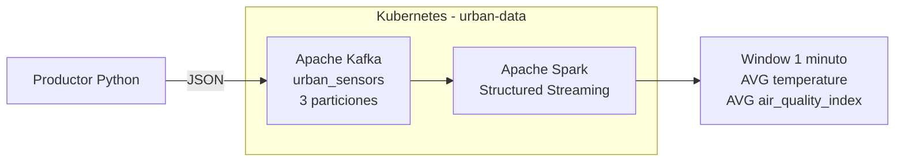
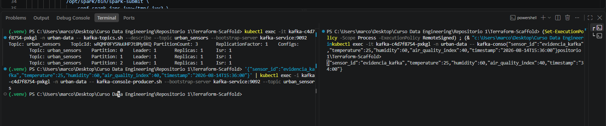
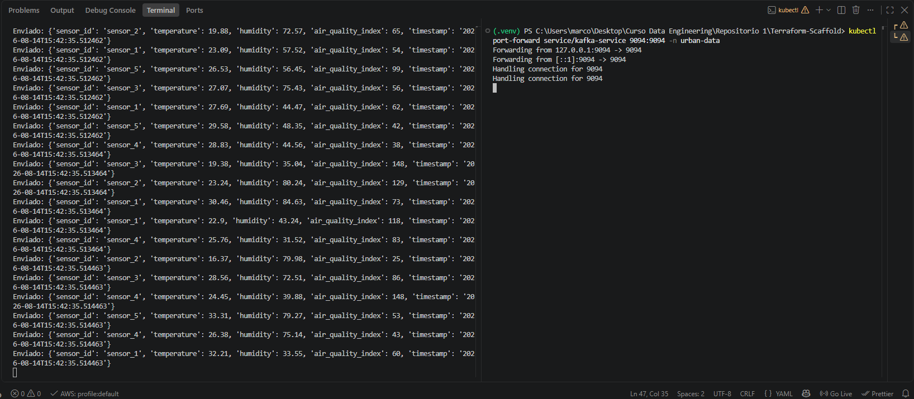
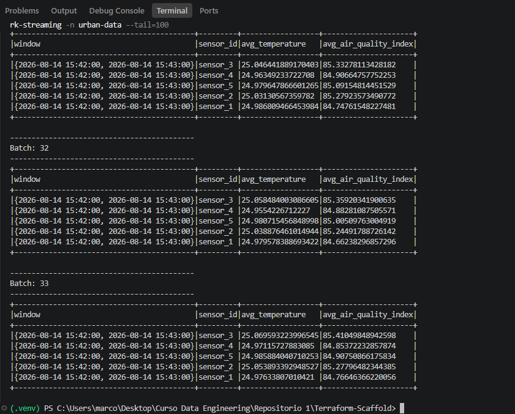
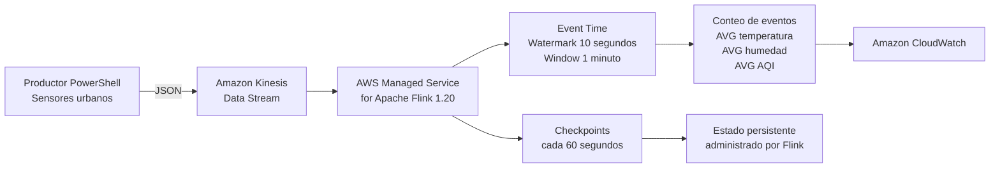
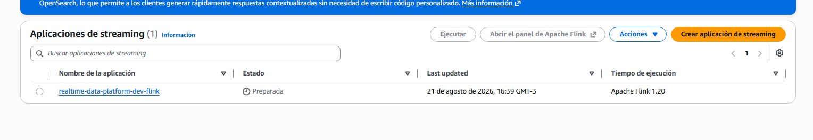
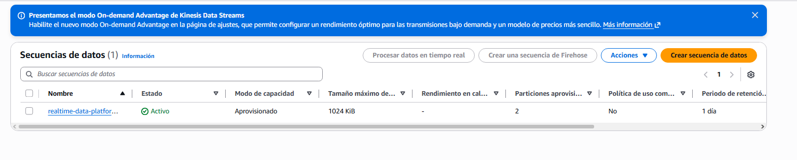
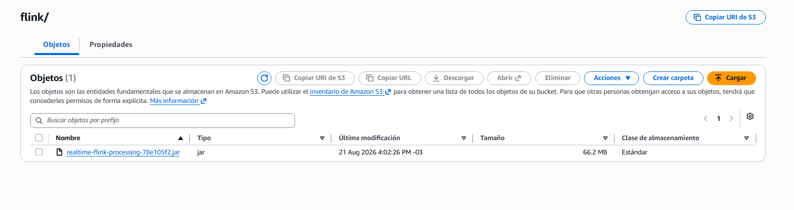

# Infraestructura de datos en AWS con Terraform

Este repositorio contiene el trabajo realizado para las preentregas 1, 2, 3 y 4 del curso de Data Engineering.

El proyecto utiliza Terraform para crear una infraestructura modular en AWS. La primera parte se enfoca en la red, los permisos y el almacenamiento remoto del estado. La segunda agrega un flujo básico de ingesta de datos en tiempo real con Amazon Kinesis y Amazon Data Firehose. La tercera incorpora un entorno local de procesamiento distribuido utilizando Kubernetes, Apache Kafka y Apache Spark Structured Streaming. La cuarta incorpora procesamiento stateful en AWS mediante Amazon Kinesis Data Streams y AWS Managed Service for Apache Flink.

## Recursos implementados

### Preentrega 1: infraestructura base

* Backend remoto de Terraform en Amazon S3.
* Tabla de DynamoDB para el bloqueo del estado.
* VPC dedicada para la plataforma de datos.
* Dos subredes privadas en diferentes zonas de disponibilidad.
* Tabla de rutas privada.
* Gateway Endpoint de S3.
* Rol IAM para servicios de procesamiento de datos.
* Política IAM con acceso limitado a un prefijo de S3.
* Rol IAM de auditoría con permisos de solo lectura.

### Preentrega 2: ingesta en tiempo real

* Amazon Kinesis Data Stream para recibir eventos.
* Amazon Data Firehose para entregar los datos en S3.
* Roles y políticas IAM necesarios para conectar los servicios.
* Alarmas de Amazon CloudWatch para monitorear el flujo.
* Script de PowerShell para enviar eventos de prueba.
* Evidencia de los archivos generados en la capa Raw/Bronze.

### Preentrega 3: procesamiento distribuido en tiempo real

* Namespace dedicado `urban-data` en Kubernetes.
* Apache Kafka desplegado mediante Deployment y Service.
* Configuración de Kafka mediante ConfigMap.
* Tópico `urban_sensors` con 3 particiones.
* Script productor en Python para generar eventos JSON de sensores urbanos.
* Apache Spark Structured Streaming desplegado en Kubernetes.
* Configuración de Spark mediante ConfigMap.
* Job de Spark montado automáticamente dentro del contenedor.
* Procesamiento de eventos mediante ventanas de 1 minuto.
* Cálculo del promedio de temperatura y calidad del aire por `sensor_id`.

### Preentrega 4: procesamiento stateful con Apache Flink

* AWS Managed Service for Apache Flink con runtime Apache Flink 1.20.
* Aplicación Java empaquetada mediante Maven.
* Consumo de eventos desde Amazon Kinesis Data Streams.
* Deserialización de eventos JSON de sensores urbanos.
* Procesamiento utilizando Event Time.
* Watermarks con una tolerancia de 10 segundos para eventos fuera de orden.
* Detección de fuentes inactivas mediante idleness de 30 segundos.
* Agrupación de eventos por `sensor_id`.
* Ventanas Tumbling Event Time de 1 minuto.
* Cálculo de cantidad de eventos y promedios de temperatura, humedad y calidad del aire.
* Checkpoints automáticos cada 60 segundos.
* Persistencia del estado mediante checkpoints administrados por Managed Flink.
* Bucket S3 para almacenar el artefacto JAR de la aplicación.
* Logs y monitoreo mediante Amazon CloudWatch.
* Rol y política IAM específicos para la aplicación Flink.
* Script de PowerShell para generar eventos de sensores y enviarlos a Kinesis.

## Estructura del proyecto

```text
Terraform-Scaffold/
|-- .gitignore
|-- PLAN_OUTPUT.md
|-- README.md
|
|-- bootstrap/
|   |-- .terraform.lock.hcl
|   |-- main.tf
|   |-- outputs.tf
|   |-- provider.tf
|   `-- variables.tf
|
|-- environments/
|   `-- dev/
|       |-- .terraform.lock.hcl
|       |-- backend.tf
|       |-- main.tf
|       |-- outputs.tf
|       |-- provider.tf
|       `-- variables.tf
|
|-- modules/
|   |-- flink/
|   |   |-- main.tf
|   |   |-- outputs.tf
|   |   `-- variables.tf
|   |
|   |-- identity/
|   |   |-- main.tf
|   |   |-- outputs.tf
|   |   `-- variables.tf
|   |
|   |-- kinesis/
|   |   |-- main.tf
|   |   |-- outputs.tf
|   |   `-- variables.tf
|   |
|   `-- network/
|       |-- main.tf
|       |-- outputs.tf
|       `-- variables.tf
|
|-- flink/
|   |-- pom.xml
|   `-- src/
|       `-- main/
|           `-- java/
|               `-- com/
|                   `-- dataops/
|                       `-- flink/
|                           `-- SensorStreamingJob.java
|
|-- k8s/
|   |-- kafka-configmap.yaml
|   |-- kafka-deployment.yaml
|   |-- kafka-service.yaml
|   |-- namespace.yaml
|   |-- spark-configmap.yaml
|   |-- spark-deployment.yaml
|   `-- spark-job-configmap.yaml
|
|-- producer/
|   `-- producer.py
|
|-- spark/
|   `-- streaming_job.py
|
|-- docs/
|   |-- evidencia-firehose-s3.png
|   |-- evidencia-kafka.png
|   |-- evidencia-kafka-producer.png
|   |-- evidencia-spark-streaming.png
|   |-- Evidencia_Productor_Kinesis.png
|   |-- Evidencia_WINDOW_RESULT.png
|   |-- Evidencia_Checkpoints_Flink.png
|   |-- evidencia-flink-aws.png
|   |-- evidencia-kinesis-aws.png
|   `-- evidencia-flink-jar-s3.png
|
`-- scripts/
    |-- send_test_events.ps1
    `-- send_sensor_events.ps1
```

Los archivos `terraform.tfvars` se mantienen únicamente de forma local y están excluidos del control de versiones mediante `.gitignore`.

Los artefactos generados por Maven dentro de `flink/target/` también se mantienen fuera del repositorio.

## Organización

### `bootstrap`

Contiene los recursos necesarios para almacenar el estado de Terraform de manera remota:

* Bucket de S3 para el archivo de estado.
* Cifrado del bucket.
* Versionado del estado.
* Tabla de DynamoDB para evitar modificaciones simultáneas.

Esta configuración se ejecuta por separado porque el backend debe existir antes de desplegar el resto de la infraestructura.

### `environments/dev`

Es el punto de entrada del entorno de desarrollo.

Desde esta carpeta se configuran el provider, el backend remoto, las variables del entorno y las llamadas a los módulos de red, identidad, ingesta y procesamiento con Flink.

### `modules/network`

Crea la infraestructura de red:

* VPC.
* Subredes privadas.
* Tabla de rutas.
* Asociaciones de las subredes.
* Gateway Endpoint para S3.

Las subredes no asignan direcciones IP públicas automáticamente.

### `modules/identity`

Crea los permisos principales del proyecto:

* Rol para servicios de procesamiento.
* Política de acceso limitado al bucket de datos.
* Rol de auditoría de solo lectura.

El acceso de procesamiento se restringe al prefijo configurado dentro del bucket.

### `modules/kinesis`

Crea los recursos de ingesta en tiempo real:

* Kinesis Data Stream.
* Data Firehose.
* Roles y políticas IAM utilizados por Firehose.
* Configuración de entrega hacia Amazon S3.
* Alarmas de CloudWatch.

Los datos entregados por Firehose se almacenan utilizando una estructura de carpetas basada en la fecha de procesamiento.

### `modules/flink`

Contiene la infraestructura necesaria para ejecutar el procesamiento en tiempo real mediante AWS Managed Service for Apache Flink.

El módulo crea:

* Bucket S3 para almacenar el artefacto JAR.
* Objeto S3 correspondiente a la aplicación compilada.
* Rol y política IAM para la ejecución de Flink.
* Grupo y stream de logs de CloudWatch.
* Aplicación de AWS Managed Service for Apache Flink.
* Configuración de checkpoints.
* Configuración de monitoreo.
* Configuración de paralelismo.

El nombre del objeto JAR almacenado en S3 incluye una parte del hash del archivo. De esta forma, cuando el código cambia, Terraform detecta un nuevo artefacto y actualiza la aplicación.

### `k8s`

Contiene los manifiestos de Kubernetes utilizados en la tercera preentrega:

* Namespace `urban-data`.
* ConfigMap de Kafka.
* Deployment de Kafka.
* Service de Kafka.
* ConfigMap de Spark.
* ConfigMap con el job de Spark.
* Deployment de Spark Structured Streaming.

### `producer`

Contiene el script Python encargado de simular datos provenientes de sensores urbanos y enviarlos al tópico `urban_sensors` de Kafka.

### `spark`

Contiene el job de Spark Structured Streaming encargado de consumir los eventos desde Kafka y procesarlos en tiempo real.

### `flink`

Contiene la aplicación Java utilizada por AWS Managed Service for Apache Flink.

El archivo principal es:

```text
flink/src/main/java/com/dataops/flink/SensorStreamingJob.java
```

La aplicación consume eventos desde Kinesis, interpreta los mensajes JSON, utiliza Event Time, genera Watermarks y procesa los datos mediante ventanas de un minuto agrupadas por `sensor_id`.

El proyecto Java utiliza Maven y su configuración se encuentra en:

```text
flink/pom.xml
```

### `scripts`

Contiene los scripts de PowerShell utilizados para generar eventos de prueba.

El archivo:

```text
scripts/send_test_events.ps1
```

se utiliza para las pruebas de ingesta realizadas con Kinesis y Firehose.

El archivo:

```text
scripts/send_sensor_events.ps1
```

genera eventos JSON de sensores urbanos utilizados para probar el procesamiento mediante AWS Managed Service for Apache Flink.

## Requisitos

Para ejecutar el proyecto se necesita:

* Terraform.
* AWS CLI v2.
* Git.
* Una cuenta de AWS.
* Credenciales configuradas localmente mediante `aws configure`.
* Docker Desktop.
* Minikube.
* kubectl.
* Python.
* Java 17.
* Apache Maven.

Las credenciales de AWS no se almacenan dentro del repositorio.

## Despliegue del backend

Ingresar en la carpeta `bootstrap`:

```powershell
cd bootstrap
```

Inicializar Terraform:

```powershell
terraform init
```

Validar la configuración:

```powershell
terraform validate
```

Revisar los cambios:

```powershell
terraform plan
```

Crear los recursos:

```powershell
terraform apply
```

## Despliegue del entorno de desarrollo

Ingresar en la carpeta del entorno:

```powershell
cd environments\dev
```

Inicializar Terraform y conectar el backend remoto:

```powershell
terraform init
```

Validar la configuración:

```powershell
terraform validate
```

Revisar los cambios:

```powershell
terraform plan
```

Desplegar la infraestructura:

```powershell
terraform apply
```

## Prueba de ingesta

Para comprobar el funcionamiento del flujo se utilizó el script:

```powershell
.\scripts\send_test_events.ps1
```

El script envía 100 eventos de prueba al Kinesis Data Stream.

Los eventos son recibidos por Data Firehose y almacenados en el bucket S3 de la capa Raw/Bronze.

La ruta generada durante la prueba fue:

```text
s3://realtime-data-platform-dev-raw/ingesta/year=2026/month=08/day=06/
```

Los archivos pueden comprobarse mediante AWS CLI:

```powershell
aws s3 ls s3://realtime-data-platform-dev-raw/ingesta/ --recursive
```

Evidencia del resultado:


## Preentrega 3: plataforma de procesamiento distribuido

La tercera etapa agrega una plataforma local de procesamiento distribuido sobre Kubernetes.

El flujo implementado es:

```text
Productor Python
      |
      v
Apache Kafka
urban_sensors
3 particiones
      |
      v
Spark Structured Streaming
      |
      v
Ventana de 1 minuto
      |
      +-- Promedio de temperatura
      `-- Promedio de calidad del aire
              por sensor_id
```

### Arquitectura



### Despliegue de Kubernetes

El entorno utiliza Minikube con Docker.

Iniciar el cluster:

```powershell
minikube start --driver=docker
```

Verificar:

```powershell
kubectl get nodes
```

Crear el namespace:

```powershell
kubectl apply -f k8s/namespace.yaml
```

### Despliegue de Kafka

Aplicar los manifiestos:

```powershell
kubectl apply -f k8s/kafka-configmap.yaml
kubectl apply -f k8s/kafka-deployment.yaml
kubectl apply -f k8s/kafka-service.yaml
```

Verificar el estado:

```powershell
kubectl get pods -n urban-data
```

Kafka debe aparecer en estado `Running`.

### Creación del tópico

Obtener el nombre del pod de Kafka:

```powershell
$KAFKA_POD = kubectl get pods -n urban-data -l app=kafka -o jsonpath="{.items[0].metadata.name}"
```

Crear el tópico `urban_sensors` con 3 particiones:

```powershell
kubectl exec -it $KAFKA_POD -n urban-data -- kafka-topics.sh --create --topic urban_sensors --bootstrap-server kafka-service:9092 --partitions 3 --replication-factor 1
```

Verificar:

```powershell
kubectl exec -it $KAFKA_POD -n urban-data -- kafka-topics.sh --describe --topic urban_sensors --bootstrap-server kafka-service:9092
```

La configuración utilizada es:

```text
Topic: urban_sensors
PartitionCount: 3
ReplicationFactor: 1
```

### Productor de eventos

El archivo:

```text
producer/producer.py
```

genera eventos JSON simulados cada 2 segundos con los siguientes campos:

* `sensor_id`
* `temperature`
* `humidity`
* `air_quality_index`
* `timestamp`

Ejemplo:

```json
{
  "sensor_id": "sensor_3",
  "temperature": 25.42,
  "humidity": 61.7,
  "air_quality_index": 84,
  "timestamp": "2026-08-14T13:16:25.123456"
}
```

El productor se ejecuta localmente y utiliza un port-forward para comunicarse con Kafka dentro de Kubernetes.

Mantener una terminal ejecutando:

```powershell
kubectl port-forward service/kafka-service 9094:9094 -n urban-data
```

En otra terminal:

```powershell
python producer/producer.py
```

El productor utiliza un intervalo de 2 segundos entre eventos para evitar una generación excesiva de mensajes durante las pruebas locales y permitir observar el flujo de datos de forma controlada.

Durante las pruebas se verificó correctamente la llegada de los eventos al tópico `urban_sensors`.

Los mensajes pueden comprobarse mediante:

```powershell
kubectl exec -it $KAFKA_POD -n urban-data -- kafka-console-consumer.sh --bootstrap-server kafka-service:9092 --topic urban_sensors --from-beginning --max-messages 10
```

### Despliegue de Spark

Aplicar los manifiestos correspondientes:

```powershell
kubectl apply -f k8s/spark-configmap.yaml
kubectl apply -f k8s/spark-job-configmap.yaml
kubectl apply -f k8s/spark-deployment.yaml
```

Verificar:

```powershell
kubectl get pods -n urban-data
```

Kafka y Spark deben aparecer en estado `Running`.

El Deployment de Spark monta automáticamente `streaming_job.py` desde el ConfigMap `spark-job-script` y ejecuta el job mediante `spark-submit`.

### Procesamiento en tiempo real

El archivo:

```text
spark/streaming_job.py
```

consume los eventos desde Kafka utilizando Spark Structured Streaming.

El job:

* Interpreta los mensajes JSON.
* Utiliza el campo `timestamp` como tiempo del evento.
* Aplica un watermark de 1 minuto.
* Utiliza ventanas de tiempo de 1 minuto.
* Agrupa los eventos por `sensor_id`.
* Calcula el promedio de `temperature`.
* Calcula el promedio de `air_quality_index`.

Los resultados pueden consultarse mediante:

```powershell
kubectl logs deployment/spark-streaming -n urban-data --tail=120
```

Durante la prueba se obtuvo una salida como:

```text
+------------------------------------------+---------+------------------+---------------------+
|window                                    |sensor_id|avg_temperature   |avg_air_quality_index|
+------------------------------------------+---------+------------------+---------------------+
|{2026-08-14 13:16:00, 2026-08-14 13:17:00}|sensor_2 |24.98107431807679 |85.28392279241794    |
|{2026-08-14 13:16:00, 2026-08-14 13:17:00}|sensor_1 |24.991138767890465|84.62329580811223    |
|{2026-08-14 13:16:00, 2026-08-14 13:17:00}|sensor_4 |25.03353926461307 |85.36511214363563    |
|{2026-08-14 13:16:00, 2026-08-14 13:17:00}|sensor_5 |24.992562948615664|84.68531388857241    |
|{2026-08-14 13:16:00, 2026-08-14 13:17:00}|sensor_3 |25.03867602127421 |85.04498132850514    |
+------------------------------------------+---------+------------------+---------------------+
```

Esto confirma la comunicación exitosa entre Kafka y Spark y el procesamiento de los eventos en tiempo real.

### Evidencias de la Preentrega 3

#### Kafka: tópico, particiones y comunicación

La siguiente evidencia muestra el tópico `urban_sensors` configurado con 3 particiones y una prueba de envío y recepción de un evento mediante Kafka.



#### Productor Python

El productor genera eventos simulados de sensores urbanos con los campos `sensor_id`, `temperature`, `humidity`, `air_quality_index` y `timestamp`, y los envía hacia Kafka mediante el listener expuesto localmente.



#### Spark Structured Streaming

Spark consume los eventos provenientes de Kafka y procesa el flujo utilizando ventanas de 1 minuto, calculando el promedio de temperatura y del índice de calidad del aire para cada sensor.



## Preentrega 4: procesamiento en tiempo real con Apache Flink

La cuarta etapa del proyecto incorpora procesamiento stateful en AWS utilizando Amazon Kinesis Data Streams y AWS Managed Service for Apache Flink.

El flujo implementado es:

```text
Productor PowerShell
        |
        v
Amazon Kinesis Data Streams
        |
        v
AWS Managed Service
for Apache Flink 1.20
        |
        v
Deserialización JSON
        |
        v
Event Time + Watermarks
        |
        v
keyBy(sensor_id)
        |
        v
Tumbling Window de 1 minuto
        |
        +-- Cantidad de eventos
        +-- Promedio de temperatura
        +-- Promedio de humedad
        `-- Promedio de calidad del aire
        |
        v
Amazon CloudWatch Logs
```

### Arquitectura



### Infraestructura de Flink

La infraestructura necesaria para Managed Flink está declarada mediante Terraform dentro de:

```text
modules/flink/
```

El módulo crea la aplicación de procesamiento, el bucket utilizado para almacenar el artefacto JAR, el rol y la política IAM necesarios y la integración con CloudWatch Logs.

La aplicación utiliza:

```text
Runtime: FLINK-1_20
Parallelism: 1
Parallelism per KPU: 1
Auto Scaling: deshabilitado
```

El Data Stream de Kinesis utilizado como fuente se configura mediante una propiedad de ejecución denominada:

```text
InputStream
```

que contiene el ARN del stream.

### Aplicación Flink

La aplicación está implementada en Java:

```text
flink/src/main/java/com/dataops/flink/SensorStreamingJob.java
```

El job obtiene el ARN del Kinesis Data Stream desde las propiedades configuradas en AWS Managed Service for Apache Flink.

Los eventos utilizados contienen:

* `sensor_id`
* `temperature`
* `humidity`
* `air_quality_index`
* `timestamp`

Ejemplo:

```json
{
  "sensor_id": "sensor_3",
  "temperature": 25.42,
  "humidity": 61.70,
  "air_quality_index": 84,
  "timestamp": "2026-08-21T19:10:35.0000000Z"
}
```

### Event Time y Watermarks

El campo `timestamp` de cada mensaje se utiliza como tiempo del evento.

La aplicación utiliza un Watermark con una tolerancia máxima de 10 segundos para eventos que puedan llegar fuera de orden.

La estrategia utilizada es equivalente a:

```text
WatermarkStrategy.forBoundedOutOfOrderness(Duration.ofSeconds(10))
```

También se configura una detección de inactividad de 30 segundos para evitar que una fuente temporalmente inactiva impida el avance global del Watermark.

### Ventanas y procesamiento stateful

Después de deserializar los eventos, el flujo se agrupa utilizando:

```text
keyBy(sensor_id)
```

Posteriormente se aplican ventanas Tumbling Event Time de 1 minuto.

Dentro de cada ventana se calcula:

* Cantidad de eventos.
* Temperatura promedio.
* Humedad promedio.
* Índice promedio de calidad del aire.

El operador de ventanas mantiene estado administrado por Apache Flink durante el procesamiento.

Los resultados se registran utilizando el logger de la aplicación y pueden consultarse posteriormente mediante CloudWatch.

Durante las pruebas se obtuvo, por ejemplo:

```text
WINDOW_RESULT sensor=sensor_1 |
window_start=2026-08-21T19:10:00Z |
window_end=2026-08-21T19:11:00Z |
events=6 |
avg_temperature=23.37 |
avg_humidity=56.41 |
avg_aqi=126.83
```

También se observaron resultados correspondientes a múltiples sensores y varias ventanas consecutivas de un minuto.

### Checkpoints y tolerancia a fallos

La aplicación utiliza checkpoints automáticos para permitir la recuperación del estado ante fallos.

La configuración declarada mediante Terraform es:

```text
Checkpoint interval: 60000 ms
Minimum pause between checkpoints: 5000 ms
Checkpointing: enabled
```

Durante las pruebas se verificó la creación continua de checkpoints.

Entre los checkpoints observados se encontraron:

```text
Completed checkpoint 52
Completed checkpoint 53
Completed checkpoint 54
Completed checkpoint 55
Completed checkpoint 56
Completed checkpoint 57
Completed checkpoint 58
```

Los logs de Managed Flink también mostraron la escritura de metadata asociada a los checkpoints mediante el sistema de archivos S3 utilizado por el servicio.

### Compilación de la aplicación

La aplicación Java utiliza Maven.

Desde la raíz del repositorio puede compilarse mediante:

```powershell
mvn -f .\flink\pom.xml clean package
```

La compilación genera el artefacto:

```text
flink/target/realtime-flink-processing-1.0.0.jar
```

La carpeta:

```text
flink/target/
```

está excluida del control de versiones.

Durante el despliegue, Terraform toma este JAR local y lo almacena dentro del bucket de artefactos de Flink.

El nombre del objeto almacenado en S3 incluye una parte del hash del archivo.

Por ejemplo:

```text
flink/realtime-flink-processing-78e105f2.jar
```

Esto permite que Terraform detecte cambios en el código de la aplicación y actualice el artefacto utilizado por Managed Flink.

### Despliegue mediante Terraform

Desde:

```powershell
cd environments\dev
```

se puede ejecutar:

```powershell
terraform init
terraform validate
terraform plan
terraform apply
```

La aplicación Managed Flink se crea inicialmente detenida.

Para consultar su estado:

```powershell
aws kinesisanalyticsv2 describe-application --application-name realtime-data-platform-dev-flink --query "ApplicationDetail.ApplicationStatus" --output text --region us-east-1
```

Una aplicación desplegada pero detenida aparece como:

```text
READY
```

Para iniciarla:

```powershell
aws kinesisanalyticsv2 start-application --application-name realtime-data-platform-dev-flink --region us-east-1
```

Durante la ejecución, el estado esperado es:

```text
RUNNING
```

### Generación de eventos de prueba

El archivo:

```text
scripts/send_sensor_events.ps1
```

genera eventos JSON simulando sensores urbanos y los envía directamente al Kinesis Data Stream.

Para realizar una prueba prolongada se utilizó:

```powershell
.\scripts\send_sensor_events.ps1 -RecordCount 180 -DelayMilliseconds 500
```

Durante la prueba se generaron datos correspondientes a cinco sensores diferentes y se enviaron correctamente 180 eventos.

### Consulta de resultados en CloudWatch

Los resultados de las ventanas pueden consultarse utilizando:

```powershell
aws logs filter-log-events --log-group-name "/aws/managed-flink/realtime-data-platform-dev" --filter-pattern "WINDOW_RESULT" --region us-east-1 --query "events[].message" --output text --no-cli-pager
```

Los mensajes muestran el sensor procesado, la ventana temporal, la cantidad de eventos y los valores promedio obtenidos.

Los checkpoints también pueden consultarse mediante los logs de CloudWatch.

### Evidencias de la Preentrega 4

#### Productor hacia Kinesis

El productor PowerShell genera eventos JSON de sensores urbanos y los envía directamente hacia Amazon Kinesis Data Streams.

Durante la prueba se enviaron correctamente 180 eventos.


#### Procesamiento de ventanas con Flink

Los logs de CloudWatch muestran los resultados generados por Flink para múltiples sensores y ventanas consecutivas de un minuto.

Cada resultado incluye la cantidad de eventos procesados y los promedios de temperatura, humedad y calidad del aire.


#### Checkpoints de Flink

Durante la ejecución se verificó que los checkpoints se completaran periódicamente.

La evidencia muestra múltiples checkpoints finalizados correctamente junto con su tamaño y duración.


#### Aplicación AWS Managed Service for Apache Flink

La aplicación `realtime-data-platform-dev-flink` fue desplegada correctamente utilizando Apache Flink 1.20.



#### Amazon Kinesis Data Stream

El stream `realtime-data-platform-dev-stream` fue desplegado correctamente en modo provisionado utilizando dos shards.



#### Artefacto JAR en Amazon S3

El artefacto compilado de la aplicación fue almacenado correctamente en el bucket S3 destinado a Managed Flink.



### Limpieza de recursos

Una vez finalizadas las pruebas, la aplicación puede detenerse mediante:

```powershell
aws kinesisanalyticsv2 stop-application --application-name realtime-data-platform-dev-flink --region us-east-1
```

Para evitar costos innecesarios, los recursos administrados por el entorno de desarrollo pueden eliminarse desde:

```text
environments/dev
```

mediante:

```powershell
terraform destroy
```

El backend remoto ubicado en `bootstrap` se mantiene separado del entorno de desarrollo y no forma parte de este proceso de destrucción.

## Validación del código

Desde la raíz del repositorio se puede aplicar formato a todos los archivos:

```powershell
terraform fmt -recursive
```

Luego, desde cada configuración de Terraform, se puede ejecutar:

```powershell
terraform validate
terraform plan
```

El archivo `PLAN_OUTPUT.md` contiene el resultado de uno de los planes realizados durante el desarrollo.

## Seguridad y control de versiones

El archivo `.gitignore` evita subir al repositorio:

* Carpetas `.terraform`.
* Entornos virtuales `.venv`.
* Archivos `terraform.tfstate`.
* Archivos `terraform.tfvars`.
* Copias de respaldo del estado.
* Archivos temporales.
* Credenciales y secretos.
* Configuración local de VS Code.
* Artefactos de compilación de Maven dentro de `flink/target/`.

Los archivos `.terraform.lock.hcl` sí se incluyen para mantener versiones consistentes de los providers.