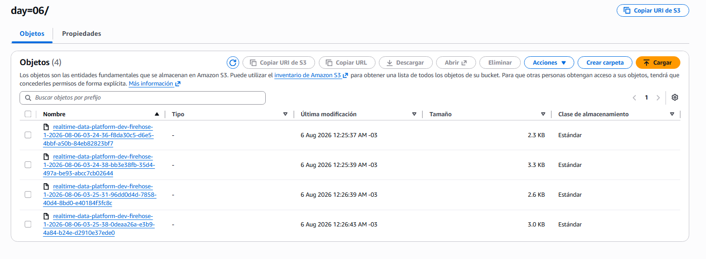

```markdown
# Checkpoint de Infraestructura Base con Terraform y AWS

Este repositorio contiene la infraestructura base de una plataforma de datos en AWS, organizada mediante módulos reutilizables de Terraform.

El objetivo de esta primera pre-entrega es preparar una base segura y modular para futuros servicios de ingesta y procesamiento de datos, como Amazon Kinesis, AWS Lambda y Amazon Managed Service for Apache Flink.

## Arquitectura implementada

El proyecto crea:

- Una VPC dedicada para datos.
- Dos subredes privadas en diferentes zonas de disponibilidad.
- Una tabla de rutas privada.
- Un S3 Gateway Endpoint asociado a la red privada.
- Un rol IAM para futuros servicios de procesamiento.
- Una política IAM con acceso limitado a un prefijo de S3.
- Un rol IAM de auditoría de solo lectura.
- Un backend remoto de Terraform en Amazon S3.
- Una tabla DynamoDB para el bloqueo del estado.

## Estructura del proyecto

~~~text
Terraform-Scaffold/
├── bootstrap/
│   ├── main.tf
│   ├── outputs.tf
│   ├── provider.tf
│   ├── terraform.tfvars
│   └── variables.tf
│
├── environments/
│   └── dev/
│       ├── backend.tf
│       ├── main.tf
│       ├── outputs.tf
│       ├── provider.tf
│       ├── terraform.tfvars
│       └── variables.tf
│
├── modules/
│   ├── identity/
│   │   ├── main.tf
│   │   ├── outputs.tf
│   │   └── variables.tf
│   │
│   └── network/
│       ├── main.tf
│       ├── outputs.tf
│       └── variables.tf
│
├── .gitignore
├── PLAN_OUTPUT.md
└── README.md
~~~

## Módulos

### Network

El módulo `network` crea:

- Una VPC con CIDR configurable.
- Dos subredes privadas.
- Una tabla de rutas privada.
- Las asociaciones entre las subredes y la tabla de rutas.
- Un S3 Gateway Endpoint.

Las subredes no asignan direcciones IP públicas automáticamente y no cuentan con rutas directas hacia Internet.

### Identity

El módulo `identity` crea:

- Un rol para servicios de procesamiento de datos.
- Una política limitada a las siguientes acciones:
  - `s3:ListBucket`
  - `s3:GetObject`
  - `s3:PutObject`
- Un rol de auditoría con permisos de solo lectura.

El acceso del rol de procesamiento se limita al prefijo `raw/` del bucket configurado.

## Backend remoto

El estado de Terraform se almacena en un bucket S3 con cifrado del lado del servidor mediante AES-256.

También se utiliza una tabla DynamoDB para evitar modificaciones simultáneas del estado durante el trabajo en equipo.

Los recursos del backend se crean desde la carpeta:

~~~text
bootstrap/
~~~

## Requisitos

Para utilizar este proyecto se necesita:

- Terraform 1.1.0 o superior.
- AWS CLI v2.
- Git.
- Una cuenta de AWS.
- Credenciales de AWS configuradas mediante `aws configure`.

Las credenciales no deben almacenarse dentro del repositorio.

## Despliegue del backend

Ingresar en la carpeta `bootstrap`:

~~~powershell
cd bootstrap
~~~

Inicializar Terraform:

~~~powershell
terraform init
~~~

Validar la configuración:

~~~powershell
terraform validate
~~~

Revisar el plan:

~~~powershell
terraform plan
~~~

Crear el bucket S3 y la tabla DynamoDB:

~~~powershell
terraform apply
~~~

## Despliegue del entorno de desarrollo

Ingresar en la carpeta del entorno:

~~~powershell
cd environments\dev
~~~

Inicializar Terraform:

~~~powershell
terraform init
~~~

Validar la configuración:

~~~powershell
terraform validate
~~~

Revisar el plan:

~~~powershell
terraform plan
~~~

Desplegar los recursos:

~~~powershell
terraform apply
~~~

## Variables del entorno dev

| Variable | Descripción | Valor de ejemplo |
| --- | --- | --- |
| `region` | Región de AWS | `us-east-1` |
| `project_name` | Nombre del proyecto | `realtime-data-platform` |
| `environment` | Entorno de despliegue | `dev` |
| `vpc_cidr` | Rango CIDR de la VPC | `10.0.0.0/16` |
| `bucket_name` | Bucket usado por el rol de procesamiento | `realtime-data-platform-dev-raw` |
| `bucket_prefix` | Prefijo autorizado dentro del bucket | `raw/` |

## Outputs

El entorno devuelve:

- `vpc_id`
- `private_subnet_ids`
- `data_processing_role_arn`
- `audit_read_only_role_arn`

Estos valores podrán utilizarse como entradas en futuros módulos de la plataforma.

## Validación

El código puede validarse desde `environments/dev` con:

~~~powershell
terraform fmt -recursive
terraform validate
terraform plan
~~~

El resultado de un plan exitoso se encuentra documentado en:

~~~text
PLAN_OUTPUT.md
~~~

## Seguridad y control de versiones

El archivo `.gitignore` excluye:

- Carpetas `.terraform/`.
- Archivos `terraform.tfstate`.
- Copias de respaldo del estado.
- Archivos temporales de Terraform.
- Credenciales y secretos.

Los archivos `.terraform.lock.hcl` sí se incluyen para mantener versiones consistentes de los providers.
```

## Prueba de ingesta en tiempo real

Se enviaron 100 eventos de prueba al Kinesis Data Stream mediante el script:

```powershell
.\scripts\send_test_events.ps1

Los eventos fueron procesados por Amazon Data Firehose y almacenados en el bucket S3 de la capa Raw/Bronze.

Ruta generada:

s3://realtime-data-platform-dev-raw/ingesta/year=2026/month=08/day=06/

Comando de verificación:

aws s3 ls s3://realtime-data-platform-dev-raw/ingesta/ --recursive

Resultado:

Resultado:

```text
2026-08-06 00:25:37       2373 ingesta/year=2026/month=08/day=06/realtime-data-platform-dev-firehose-1-2026-08-06-03-24-36-f8da30c5-d6e5-4bbf-a50b-84eb82823bf7
2026-08-06 00:25:39       3346 ingesta/year=2026/month=08/day=06/realtime-data-platform-dev-firehose-1-2026-08-06-03-24-38-bb3e38fb-35d4-497a-be93-abcc7cb02644
2026-08-06 00:26:39       2649 ingesta/year=2026/month=08/day=06/realtime-data-platform-dev-firehose-1-2026-08-06-03-25-31-96dd0d4d-7858-40d4-8bd0-e40184f3fc8c
2026-08-06 00:26:43       3070 ingesta/year=2026/month=08/day=06/realtime-data-platform-dev-firehose-1-2026-08-06-03-25-38-0deaa26a-e3b9-4a84-b24e-d2910e37ede0
2026-08-06 00:27:39        838 ingesta/year=2026/month=08/day=06/realtime-data-platform-dev-firehose-1-2026-08-06-03-26-34-eccdb37d-ae43-4783-8302-94b59672b319
2026-08-06 00:27:44       1674 ingesta/year=2026/month=08/day=06/realtime-data-platform-dev-firehose-1-2026-08-06-03-26-36-55eb8a40-b1a6-4ad9-a1f3-8faa08fcff37
```

