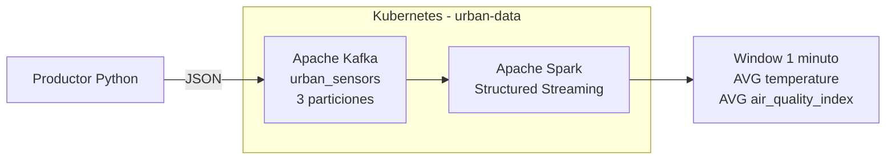

# Infraestructura de datos en AWS con Terraform

Este repositorio contiene el trabajo realizado para las preentregas 1, 2 y 3 del curso de Data Engineering.

El proyecto utiliza Terraform para crear una infraestructura modular en AWS. La primera parte se enfoca en la red, los permisos y el almacenamiento remoto del estado. La segunda agrega un flujo básico de ingesta de datos en tiempo real con Amazon Kinesis y Amazon Data Firehose. La tercera incorpora un entorno local de procesamiento distribuido utilizando Kubernetes, Apache Kafka y Apache Spark Structured Streaming.

## Recursos implementados

### Preentrega 1: infraestructura base

* Backend remoto de Terraform en Amazon S3.
* Tabla de DynamoDB para el bloqueo del estado.
* VPC dedicada para la plataforma de datos.
* Dos subredes privadas en diferentes zonas de disponibilidad.
* Tabla de rutas privada.
* Gateway Endpoint de S3.
* Rol IAM para servicios de procesamiento de datos.
* Política IAM con acceso limitado a un prefijo de S3.
* Rol IAM de auditoría con permisos de solo lectura.

### Preentrega 2: ingesta en tiempo real

* Amazon Kinesis Data Stream para recibir eventos.
* Amazon Data Firehose para entregar los datos en S3.
* Roles y políticas IAM necesarios para conectar los servicios.
* Alarmas de Amazon CloudWatch para monitorear el flujo.
* Script de PowerShell para enviar eventos de prueba.
* Evidencia de los archivos generados en la capa Raw/Bronze.

### Preentrega 3: procesamiento distribuido en tiempo real

* Namespace dedicado `urban-data` en Kubernetes.
* Apache Kafka desplegado mediante Deployment y Service.
* Configuración de Kafka mediante ConfigMap.
* Tópico `urban_sensors` con 3 particiones.
* Script productor en Python para generar eventos JSON de sensores urbanos.
* Apache Spark Structured Streaming desplegado en Kubernetes.
* Configuración de Spark mediante ConfigMap.
* Job de Spark montado automáticamente dentro del contenedor.
* Procesamiento de eventos mediante ventanas de 1 minuto.
* Cálculo del promedio de temperatura y calidad del aire por `sensor_id`.

## Estructura del proyecto

```text
Terraform-Scaffold/
|-- .gitignore
|-- PLAN_OUTPUT.md
|-- README.md
|
|-- bootstrap/
|   |-- .terraform.lock.hcl
|   |-- main.tf
|   |-- outputs.tf
|   |-- provider.tf
|   `-- variables.tf
|
|-- environments/
|   `-- dev/
|       |-- .terraform.lock.hcl
|       |-- backend.tf
|       |-- main.tf
|       |-- outputs.tf
|       |-- provider.tf
|       `-- variables.tf
|
|-- modules/
|   |-- identity/
|   |   |-- main.tf
|   |   |-- outputs.tf
|   |   `-- variables.tf
|   |
|   |-- kinesis/
|   |   |-- main.tf
|   |   |-- outputs.tf
|   |   `-- variables.tf
|   |
|   `-- network/
|       |-- main.tf
|       |-- outputs.tf
|       `-- variables.tf
|
|-- k8s/
|   |-- kafka-configmap.yaml
|   |-- kafka-deployment.yaml
|   |-- kafka-service.yaml
|   |-- namespace.yaml
|   |-- spark-configmap.yaml
|   |-- spark-deployment.yaml
|   `-- spark-job-configmap.yaml
|
|-- producer/
|   `-- producer.py
|
|-- spark/
|   `-- streaming_job.py
|
|-- docs/
|   |-- evidencia-firehose-s3.png
|   |-- evidencia-kafka.png
|   |-- evidencia-kafka-producer.png
|   `-- evidencia-spark-streaming.png
|
`-- scripts/
    `-- send_test_events.ps1
```

Los archivos `terraform.tfvars` se mantienen únicamente de forma local y están excluidos del control de versiones mediante `.gitignore`.

## Organización

### `bootstrap`

Contiene los recursos necesarios para almacenar el estado de Terraform de manera remota:

* Bucket de S3 para el archivo de estado.
* Cifrado del bucket.
* Versionado del estado.
* Tabla de DynamoDB para evitar modificaciones simultáneas.

Esta configuración se ejecuta por separado porque el backend debe existir antes de desplegar el resto de la infraestructura.

### `environments/dev`

Es el punto de entrada del entorno de desarrollo.

Desde esta carpeta se configuran el provider, el backend remoto, las variables del entorno y las llamadas a los módulos de red, identidad e ingesta.

### `modules/network`

Crea la infraestructura de red:

* VPC.
* Subredes privadas.
* Tabla de rutas.
* Asociaciones de las subredes.
* Gateway Endpoint para S3.

Las subredes no asignan direcciones IP públicas automáticamente.

### `modules/identity`

Crea los permisos principales del proyecto:

* Rol para servicios de procesamiento.
* Política de acceso limitado al bucket de datos.
* Rol de auditoría de solo lectura.

El acceso de procesamiento se restringe al prefijo configurado dentro del bucket.

### `modules/kinesis`

Crea los recursos de ingesta en tiempo real:

* Kinesis Data Stream.
* Data Firehose.
* Roles y políticas IAM utilizados por Firehose.
* Configuración de entrega hacia Amazon S3.
* Alarmas de CloudWatch.

Los datos entregados por Firehose se almacenan utilizando una estructura de carpetas basada en la fecha de procesamiento.

### `k8s`

Contiene los manifiestos de Kubernetes utilizados en la tercera preentrega:

* Namespace `urban-data`.
* ConfigMap de Kafka.
* Deployment de Kafka.
* Service de Kafka.
* ConfigMap de Spark.
* ConfigMap con el job de Spark.
* Deployment de Spark Structured Streaming.

### `producer`

Contiene el script Python encargado de simular datos provenientes de sensores urbanos y enviarlos al tópico `urban_sensors` de Kafka.

### `spark`

Contiene el job de Spark Structured Streaming encargado de consumir los eventos desde Kafka y procesarlos en tiempo real.

## Requisitos

Para ejecutar el proyecto se necesita:

* Terraform.
* AWS CLI v2.
* Git.
* Una cuenta de AWS.
* Credenciales configuradas localmente mediante `aws configure`.
* Docker Desktop.
* Minikube.
* kubectl.
* Python.

Las credenciales de AWS no se almacenan dentro del repositorio.

## Despliegue del backend

Ingresar en la carpeta `bootstrap`:

```powershell
cd bootstrap
```

Inicializar Terraform:

```powershell
terraform init
```

Validar la configuración:

```powershell
terraform validate
```

Revisar los cambios:

```powershell
terraform plan
```

Crear los recursos:

```powershell
terraform apply
```

## Despliegue del entorno de desarrollo

Ingresar en la carpeta del entorno:

```powershell
cd environments\dev
```

Inicializar Terraform y conectar el backend remoto:

```powershell
terraform init
```

Validar la configuración:

```powershell
terraform validate
```

Revisar los cambios:

```powershell
terraform plan
```

Desplegar la infraestructura:

```powershell
terraform apply
```

## Prueba de ingesta

Para comprobar el funcionamiento del flujo se utilizó el script:

```powershell
.\scripts\send_test_events.ps1
```

El script envía 100 eventos de prueba al Kinesis Data Stream.

Los eventos son recibidos por Data Firehose y almacenados en el bucket S3 de la capa Raw/Bronze.

La ruta generada durante la prueba fue:

```text
s3://realtime-data-platform-dev-raw/ingesta/year=2026/month=08/day=06/
```

Los archivos pueden comprobarse mediante AWS CLI:

```powershell
aws s3 ls s3://realtime-data-platform-dev-raw/ingesta/ --recursive
```

Evidencia del resultado:


## Preentrega 3: plataforma de procesamiento distribuido

La tercera etapa agrega una plataforma local de procesamiento distribuido sobre Kubernetes.

El flujo implementado es:

```text
Productor Python
      |
      v
Apache Kafka
urban_sensors
3 particiones
      |
      v
Spark Structured Streaming
      |
      v
Ventana de 1 minuto
      |
      +-- Promedio de temperatura
      `-- Promedio de calidad del aire
              por sensor_id
```

### Arquitectura



### Despliegue de Kubernetes

El entorno utiliza Minikube con Docker.

Iniciar el cluster:

```powershell
minikube start --driver=docker
```

Verificar:

```powershell
kubectl get nodes
```

Crear el namespace:

```powershell
kubectl apply -f k8s/namespace.yaml
```

### Despliegue de Kafka

Aplicar los manifiestos:

```powershell
kubectl apply -f k8s/kafka-configmap.yaml
kubectl apply -f k8s/kafka-deployment.yaml
kubectl apply -f k8s/kafka-service.yaml
```

Verificar el estado:

```powershell
kubectl get pods -n urban-data
```

Kafka debe aparecer en estado `Running`.

### Creación del tópico

Obtener el nombre del pod de Kafka:

```powershell
$KAFKA_POD = kubectl get pods -n urban-data -l app=kafka -o jsonpath="{.items[0].metadata.name}"
```

Crear el tópico `urban_sensors` con 3 particiones:

```powershell
kubectl exec -it $KAFKA_POD -n urban-data -- kafka-topics.sh --create --topic urban_sensors --bootstrap-server kafka-service:9092 --partitions 3 --replication-factor 1
```

Verificar:

```powershell
kubectl exec -it $KAFKA_POD -n urban-data -- kafka-topics.sh --describe --topic urban_sensors --bootstrap-server kafka-service:9092
```

La configuración utilizada es:

```text
Topic: urban_sensors
PartitionCount: 3
ReplicationFactor: 1
```

### Productor de eventos

El archivo:

```text
producer/producer.py
```

genera continuamente eventos JSON con los siguientes campos:

* `sensor_id`
* `temperature`
* `humidity`
* `air_quality_index`
* `timestamp`

Ejemplo:

```json
{
  "sensor_id": "sensor_3",
  "temperature": 25.42,
  "humidity": 61.7,
  "air_quality_index": 84,
  "timestamp": "2026-08-14T13:16:25.123456"
}
```

El productor se ejecuta localmente y utiliza un port-forward para comunicarse con Kafka dentro de Kubernetes.

Mantener una terminal ejecutando:

```powershell
kubectl port-forward service/kafka-service 9094:9094 -n urban-data
```

En otra terminal:

```powershell
python producer/producer.py
```

Durante las pruebas se verificó correctamente la llegada de los eventos al tópico `urban_sensors`.

Los mensajes pueden comprobarse mediante:

```powershell
kubectl exec -it $KAFKA_POD -n urban-data -- kafka-console-consumer.sh --bootstrap-server kafka-service:9092 --topic urban_sensors --from-beginning --max-messages 10
```

### Despliegue de Spark

Aplicar los manifiestos correspondientes:

```powershell
kubectl apply -f k8s/spark-configmap.yaml
kubectl apply -f k8s/spark-job-configmap.yaml
kubectl apply -f k8s/spark-deployment.yaml
```

Verificar:

```powershell
kubectl get pods -n urban-data
```

Kafka y Spark deben aparecer en estado `Running`.

El Deployment de Spark monta automáticamente `streaming_job.py` desde el ConfigMap `spark-job-script` y ejecuta el job mediante `spark-submit`.

### Procesamiento en tiempo real

El archivo:

```text
spark/streaming_job.py
```

consume los eventos desde Kafka utilizando Spark Structured Streaming.

El job:

* Interpreta los mensajes JSON.
* Utiliza el campo `timestamp` como tiempo del evento.
* Aplica un watermark de 1 minuto.
* Utiliza ventanas de tiempo de 1 minuto.
* Agrupa los eventos por `sensor_id`.
* Calcula el promedio de `temperature`.
* Calcula el promedio de `air_quality_index`.

Los resultados pueden consultarse mediante:

```powershell
kubectl logs deployment/spark-streaming -n urban-data --tail=120
```

Durante la prueba se obtuvo una salida como:

```text
+------------------------------------------+---------+------------------+---------------------+
|window                                    |sensor_id|avg_temperature   |avg_air_quality_index|
+------------------------------------------+---------+------------------+---------------------+
|{2026-08-14 13:16:00, 2026-08-14 13:17:00}|sensor_2 |24.98107431807679 |85.28392279241794    |
|{2026-08-14 13:16:00, 2026-08-14 13:17:00}|sensor_1 |24.991138767890465|84.62329580811223    |
|{2026-08-14 13:16:00, 2026-08-14 13:17:00}|sensor_4 |25.03353926461307 |85.36511214363563    |
|{2026-08-14 13:16:00, 2026-08-14 13:17:00}|sensor_5 |24.992562948615664|84.68531388857241    |
|{2026-08-14 13:16:00, 2026-08-14 13:17:00}|sensor_3 |25.03867602127421 |85.04498132850514    |
+------------------------------------------+---------+------------------+---------------------+
```

Esto confirma la comunicación exitosa entre Kafka y Spark y el procesamiento de los eventos en tiempo real.

### Evidencias de la Preentrega 3

#### Kafka: tópico, particiones y comunicación

La siguiente evidencia muestra el tópico `urban_sensors` configurado con 3 particiones y una prueba de envío y recepción de un evento mediante Kafka.


#### Productor Python

El productor genera eventos simulados de sensores urbanos con los campos `sensor_id`, `temperature`, `humidity`, `air_quality_index` y `timestamp`, y los envía hacia Kafka mediante el listener expuesto localmente.


#### Spark Structured Streaming

Spark consume los eventos provenientes de Kafka y procesa el flujo utilizando ventanas de 1 minuto, calculando el promedio de temperatura y del índice de calidad del aire para cada sensor.


## Validación del código

Desde la raíz del repositorio se puede aplicar formato a todos los archivos:

```powershell
terraform fmt -recursive
```

Luego, desde cada configuración de Terraform, se puede ejecutar:

```powershell
terraform validate
terraform plan
```

El archivo `PLAN_OUTPUT.md` contiene el resultado de uno de los planes realizados durante el desarrollo.

## Seguridad y control de versiones

El archivo `.gitignore` evita subir al repositorio:

* Carpetas `.terraform`.
* Entornos virtuales `.venv`.
* Archivos `terraform.tfstate`.
* Archivos `terraform.tfvars`.
* Copias de respaldo del estado.
* Archivos temporales.
* Credenciales y secretos.

Los archivos `.terraform.lock.hcl` sí se incluyen para mantener versiones consistentes de los providers.
