# Infraestructura de datos en AWS con Terraform

Este repositorio contiene el trabajo realizado para las preentregas 1, 2, 3, 4, 5 y 6 del curso de Data Engineering.

El proyecto utiliza Terraform para crear una infraestructura modular en AWS. La primera parte se enfoca en la red, los permisos y el almacenamiento remoto del estado. La segunda agrega un flujo básico de ingesta de datos en tiempo real con Amazon Kinesis y Amazon Data Firehose. La tercera incorpora un entorno local de procesamiento distribuido utilizando Kubernetes, Apache Kafka y Apache Spark Structured Streaming. La cuarta incorpora procesamiento stateful en AWS mediante Amazon Kinesis Data Streams y AWS Managed Service for Apache Flink. La quinta extiende este procesamiento hacia una arquitectura Lakehouse utilizando Apache Iceberg, Amazon S3, AWS Glue Data Catalog y Amazon Athena. La sexta incorpora una capa analítica de baja latencia mediante Amazon Redshift Serverless, utilizando Redshift Streaming Ingestion para consumir eventos directamente desde Kinesis, Materialized Views incrementales, integración con el Lakehouse Iceberg mediante AWS Glue Data Catalog y consultas que combinan datos calientes e históricos.

## Recursos implementados

### Preentrega 1: infraestructura base

* Backend remoto de Terraform en Amazon S3.
* Tabla de DynamoDB para el bloqueo del estado.
* VPC dedicada para la plataforma de datos.
* Dos subredes privadas en diferentes zonas de disponibilidad.
* Tabla de rutas privada.
* Gateway Endpoint de S3.
* Rol IAM para servicios de procesamiento de datos.
* Política IAM con acceso limitado a un prefijo de S3.
* Rol IAM de auditoría con permisos de solo lectura.

### Preentrega 2: ingesta en tiempo real

* Amazon Kinesis Data Stream para recibir eventos.
* Amazon Data Firehose para entregar los datos en S3.
* Roles y políticas IAM necesarios para conectar los servicios.
* Alarmas de Amazon CloudWatch para monitorear el flujo.
* Script de PowerShell para enviar eventos de prueba.
* Evidencia de los archivos generados en la capa Raw/Bronze.

### Preentrega 3: procesamiento distribuido en tiempo real

* Namespace dedicado `urban-data` en Kubernetes.
* Apache Kafka desplegado mediante Deployment y Service.
* Configuración de Kafka mediante ConfigMap.
* Tópico `urban_sensors` con 3 particiones.
* Script productor en Python para generar eventos JSON de sensores urbanos.
* Apache Spark Structured Streaming desplegado en Kubernetes.
* Configuración de Spark mediante ConfigMap.
* Job de Spark montado automáticamente dentro del contenedor.
* Procesamiento de eventos mediante ventanas de 1 minuto.
* Cálculo del promedio de temperatura y calidad del aire por `sensor_id`.

### Preentrega 4: procesamiento stateful con Apache Flink

* AWS Managed Service for Apache Flink con runtime Apache Flink 1.20.
* Aplicación Java empaquetada mediante Maven.
* Consumo de eventos desde Amazon Kinesis Data Streams.
* Deserialización de eventos JSON de sensores urbanos.
* Procesamiento utilizando Event Time.
* Watermarks con una tolerancia de 10 segundos para eventos fuera de orden.
* Detección de fuentes inactivas mediante idleness de 30 segundos.
* Agrupación de eventos por `sensor_id`.
* Ventanas Tumbling Event Time de 1 minuto.
* Cálculo de cantidad de eventos y promedios de temperatura, humedad y calidad del aire.
* Checkpoints automáticos cada 60 segundos.
* Persistencia del estado mediante checkpoints administrados por Managed Flink.
* Bucket S3 para almacenar el artefacto JAR de la aplicación.
* Logs y monitoreo mediante Amazon CloudWatch.
* Rol y política IAM específicos para la aplicación Flink.
* Script de PowerShell para generar eventos de sensores y enviarlos a Kinesis.

### Preentrega 5: Lakehouse con Apache Iceberg

* Bucket S3 dedicado al warehouse del Lakehouse.
* Versionado y cifrado habilitados en el bucket.
* Base de datos `lakehouse_db` en AWS Glue Data Catalog.
* Tabla Apache Iceberg `sensor_metrics`.
* Integración de AWS Managed Service for Apache Flink con Apache Iceberg.
* AWS Glue utilizado como catálogo de la tabla.
* Amazon S3 utilizado para almacenar datos y metadata de Iceberg.
* Escritura de resultados procesados mediante `IcebergSink`.
* Archivos de datos almacenados en formato Parquet.
* Metadata, manifests y snapshots administrados por Apache Iceberg.
* Particionamiento de la tabla por día utilizando `window_start`.
* Permisos IAM para que Flink pueda operar con S3 y AWS Glue.
* Commits de Iceberg coordinados con los checkpoints de Flink.
* Consulta de la tabla Iceberg desde Amazon Athena.
* Validación end-to-end del flujo Kinesis → Flink → Iceberg → Glue → Athena.

### Preentrega 6: analítica avanzada in-stream con Amazon Redshift

* Amazon Redshift Serverless desplegado mediante Terraform.
* Namespace `realtime-data-platform-dev` y Workgroup `realtime-data-platform-dev-wg`.
* Capacidad base y máxima limitada a 4 RPU.
* Límite diario de uso de compute configurado para controlar costos.
* Tercera subred privada agregada en una tercera Availability Zone.
* DNS Support y DNS Hostnames habilitados en la VPC para utilizar Private DNS.
* Interface VPC Endpoint privado para Amazon Kinesis Data Streams.
* Rol y política IAM específicos para Redshift.
* Redshift Streaming Ingestion desde Kinesis sin utilizar S3 como intermediario.
* External Schema `kinesis_stream` conectado directamente al Kinesis Data Stream.
* Materialized View `sensor_stream_raw` para ingerir y validar payloads JSON.
* Validación de JSON mediante `CAN_JSON_PARSE` y transformación a `SUPER` mediante `JSON_PARSE`.
* Materialized View `sensor_stream_typed` para extraer y convertir los campos del evento a tipos SQL.
* Mantenimiento incremental validado en ambas Materialized Views.
* View `sensor_stream_ready` como capa analítica final para los datos calientes.
* External Schema `lakehouse_ext` conectado con AWS Glue Data Catalog.
* Consulta de la tabla Apache Iceberg `sensor_metrics` desde Redshift.
* JOIN entre datos calientes provenientes de Kinesis y métricas históricas almacenadas en Iceberg.
* Monitoreo de Streaming Ingestion mediante `SYS_STREAM_SCAN_STATES`.
* Medición del lag de ingesta y registros omitidos por shard.
* Rol SQL `analytics_reader` con permisos restringidos para la capa analítica.
* Script SQL consolidado en `redshift/streaming_ingestion.sql`.

## Estructura del proyecto

```text
Terraform-Capstone/
|-- .gitignore
|-- PLAN_OUTPUT.md
|-- README.md
|
|-- terraform/bootstrap/
|   |-- .terraform.lock.hcl
|   |-- main.tf
|   |-- outputs.tf
|   |-- provider.tf
|   `-- variables.tf
|
|-- terraform/environments/
|   `-- dev/
|       |-- .terraform.lock.hcl
|       |-- backend.tf
|       |-- main.tf
|       |-- outputs.tf
|       |-- provider.tf
|       `-- variables.tf
|
|-- terraform/modules/
|   |-- flink/
|   |   |-- main.tf
|   |   |-- outputs.tf
|   |   `-- variables.tf
|   |
|   |-- identity/
|   |   |-- main.tf
|   |   |-- outputs.tf
|   |   `-- variables.tf
|   |
|   |-- kinesis/
|   |   |-- main.tf
|   |   |-- outputs.tf
|   |   `-- variables.tf
|   |
|   |-- lakehouse/
|   |   |-- main.tf
|   |   |-- outputs.tf
|   |   `-- variables.tf
|   |
|   |-- redshift/
|   |   |-- main.tf
|   |   |-- outputs.tf
|   |   `-- variables.tf
|   |
|   `-- network/
|       |-- main.tf
|       |-- outputs.tf
|       `-- variables.tf
|
|-- flink/
|   |-- pom.xml
|   `-- src/
|       `-- main/
|           `-- java/
|               `-- com/
|                   `-- dataops/
|                       `-- flink/
|                           `-- SensorStreamingJob.java
|
|-- k8s/
|   |-- kafka-configmap.yaml
|   |-- kafka-deployment.yaml
|   |-- kafka-service.yaml
|   |-- namespace.yaml
|   |-- spark-configmap.yaml
|   |-- spark-deployment.yaml
|   `-- spark-job-configmap.yaml
|
|-- producer/
|   `-- producer.py
|
|-- spark/
|   `-- streaming_job.py
|
|-- redshift/
|   `-- streaming_ingestion.sql
|
|-- docs/
|   |-- evidencia-firehose-s3.png
|   |-- evidencia-kafka.png
|   |-- evidencia-kafka-producer.png
|   |-- evidencia-spark-streaming.png
|   |-- evidencia-kinesis-producer.png
|   |-- evidencia-flink-window-results.png
|   |-- evidencia-flink-checkpoints.png
|   |-- evidencia-flink-aws.png
|   |-- evidencia-kinesis-aws.png
|   |-- evidencia-flink-jar-s3.png
|   |-- evidencia-glue-iceberg.png
|   |-- evidencia-s3-iceberg.png
|   |-- evidencia-athena-iceberg.png
|   |-- evidencia-redshift-streaming-raw.png
|   |-- evidencia-redshift-ready-view.png
|   |-- evidencia-redshift-incremental.png
|   |-- evidencia-redshift-iceberg-query.png
|   |-- evidencia-redshift-join-hot-historico.png
|   |-- evidencia-redshift-lag.png
|   |-- evidencia-redshift-seguridad.png
|   `-- evidencia-redshift-iceberg-metadata.png
|
`-- scripts/
    |-- send_test_events.ps1
    `-- send_sensor_events.ps1
```

Los archivos `terraform.tfvars` se mantienen únicamente de forma local y están excluidos del control de versiones mediante `.gitignore`.

Los artefactos generados por Maven dentro de `flink/target/` también se mantienen fuera del repositorio.

## Organización

### `terraform/bootstrap`

Contiene los recursos necesarios para almacenar el estado de Terraform de manera remota:

* Bucket de S3 para el archivo de estado.
* Cifrado del bucket.
* Versionado del estado.
* Tabla de DynamoDB para evitar modificaciones simultáneas.

Esta configuración se ejecuta por separado porque el backend debe existir antes de desplegar el resto de la infraestructura.

### `terraform/environments/dev`

Es el punto de entrada del entorno de desarrollo.

Desde esta carpeta se configuran el provider, el backend remoto, las variables del entorno y las llamadas a los módulos de red, identidad, ingesta, procesamiento con Flink, almacenamiento Lakehouse y analítica con Redshift Serverless.

### `terraform/modules/network`

Crea la infraestructura de red:

* VPC.
* Tres subredes privadas distribuidas en diferentes Availability Zones.
* Tabla de rutas.
* Asociaciones de las subredes.
* Gateway Endpoint para S3.

La VPC mantiene habilitados `enable_dns_support` y `enable_dns_hostnames`, necesarios para utilizar Private DNS en los Interface VPC Endpoints incorporados durante la sexta preentrega.

Las subredes no asignan direcciones IP públicas automáticamente.

### `terraform/modules/identity`

Crea los permisos principales del proyecto:

* Rol para servicios de procesamiento.
* Política de acceso limitado al bucket de datos.
* Rol de auditoría de solo lectura.

El acceso de procesamiento se restringe al prefijo configurado dentro del bucket.

### `terraform/modules/kinesis`

Crea los recursos de ingesta en tiempo real:

* Kinesis Data Stream.
* Data Firehose.
* Roles y políticas IAM utilizados por Firehose.
* Configuración de entrega hacia Amazon S3.
* Alarmas de CloudWatch.

Los datos entregados por Firehose se almacenan utilizando una estructura de carpetas basada en la fecha de procesamiento.

### `terraform/modules/flink`

Contiene la infraestructura necesaria para ejecutar el procesamiento en tiempo real mediante AWS Managed Service for Apache Flink.

El módulo crea:

* Bucket S3 para almacenar el artefacto JAR.
* Objeto S3 correspondiente a la aplicación compilada.
* Rol y política IAM para la ejecución de Flink.
* Grupo y stream de logs de CloudWatch.
* Aplicación de AWS Managed Service for Apache Flink.
* Configuración de checkpoints.
* Configuración de monitoreo.
* Configuración de paralelismo.

A partir de la quinta preentrega, el módulo también configura las propiedades necesarias para que la aplicación conozca la ubicación del warehouse de Apache Iceberg y la base de datos utilizada en AWS Glue.

El rol de ejecución de Flink posee además permisos para leer y escribir objetos dentro del bucket del Lakehouse y consultar, crear o actualizar las tablas necesarias en AWS Glue Data Catalog.

El nombre del objeto JAR almacenado en S3 incluye una parte del hash del archivo. De esta forma, cuando el código cambia, Terraform detecta un nuevo artefacto y actualiza la aplicación.

### `terraform/modules/lakehouse`

Contiene la infraestructura utilizada para la capa Lakehouse incorporada en la quinta preentrega.

El módulo crea:

* Bucket S3 dedicado al warehouse de Apache Iceberg.
* Versionado del bucket.
* Cifrado server-side mediante AES256.
* Bloqueo de acceso público.
* Base de datos `lakehouse_db` en AWS Glue Data Catalog.

La ruta del warehouse se construye dentro del bucket utilizando el prefijo:

```text
warehouse/
```

y se entrega como output para que pueda ser utilizada por la aplicación de Apache Flink.

### `terraform/modules/redshift`

Contiene la infraestructura utilizada para la capa analítica de baja latencia incorporada en la sexta preentrega.

El módulo crea:

* Rol IAM específico para Amazon Redshift.
* Política IAM con permisos para consumir Kinesis Data Streams.
* Permisos de lectura sobre AWS Glue Data Catalog.
* Permisos de lectura sobre el bucket del Lakehouse y sus objetos Iceberg.
* Permiso `kms:Decrypt` para consumir el stream cifrado de Kinesis.
* Security Group para Redshift Serverless.
* Security Group para el Interface VPC Endpoint de Kinesis.
* Interface VPC Endpoint para `kinesis-streams`.
* Namespace de Amazon Redshift Serverless.
* Workgroup de Amazon Redshift Serverless.
* Límite diario de uso de compute.

El Workgroup utiliza:

```text
Base capacity: 4 RPU
Max capacity: 4 RPU
Public access: disabled
```

El Namespace utiliza la base de datos:

```text
analytics
```

y administra la contraseña del usuario administrador mediante AWS Secrets Manager.

El rol IAM asociado a Redshift permite consumir el Kinesis Data Stream directamente y consultar el catálogo y los objetos que forman parte del Lakehouse.

### `k8s`

Contiene los manifiestos de Kubernetes utilizados en la tercera preentrega:

* Namespace `urban-data`.
* ConfigMap de Kafka.
* Deployment de Kafka.
* Service de Kafka.
* ConfigMap de Spark.
* ConfigMap con el job de Spark.
* Deployment de Spark Structured Streaming.

### `producer`

Contiene el script Python encargado de simular datos provenientes de sensores urbanos y enviarlos al tópico `urban_sensors` de Kafka.

### `spark`

Contiene el job de Spark Structured Streaming encargado de consumir los eventos desde Kafka y procesarlos en tiempo real.

### `flink`

Contiene la aplicación Java utilizada por AWS Managed Service for Apache Flink.

El archivo principal es:

```text
flink/src/main/java/com/dataops/flink/SensorStreamingJob.java
```

La aplicación consume eventos desde Kinesis, interpreta los mensajes JSON, utiliza Event Time, genera Watermarks y procesa los datos mediante ventanas de un minuto agrupadas por `sensor_id`.

A partir de la quinta preentrega, los resultados de estas ventanas también se convierten al esquema de la tabla Iceberg y se escriben mediante `IcebergSink`.

El proyecto Java utiliza Maven y su configuración se encuentra en:

```text
flink/pom.xml
```

### `redshift`

Contiene el script SQL utilizado para implementar y validar Redshift Streaming Ingestion.

El archivo principal es:

```text
redshift/streaming_ingestion.sql
```

El script consolida:

* Creación del External Schema conectado con Kinesis.
* Creación de las Materialized Views de streaming.
* Validación y parseo de JSON.
* Conversión de campos a tipos SQL.
* Estrategia de refresh manual.
* Validación del mantenimiento incremental.
* Integración con AWS Glue Data Catalog.
* Consultas sobre la tabla Iceberg.
* JOIN entre datos calientes e históricos.
* Consulta de monitoreo del lag de ingesta.
* Configuración del rol SQL de analítica.

### `scripts`

Contiene los scripts de PowerShell utilizados para generar eventos de prueba.

El archivo:

```text
scripts/send_test_events.ps1
```

se utilizó inicialmente para las pruebas de ingesta realizadas con Kinesis y Firehose.

En la quinta preentrega fue actualizado para generar eventos JSON con el esquema de sensores esperado por la aplicación Flink:

* `sensor_id`
* `temperature`
* `humidity`
* `air_quality_index`
* `timestamp`

El archivo:

```text
scripts/send_sensor_events.ps1
```

genera eventos JSON de sensores urbanos utilizados para probar el procesamiento mediante AWS Managed Service for Apache Flink.

## Requisitos

Para ejecutar el proyecto se necesita:

* Terraform.
* AWS CLI v2.
* Git.
* Una cuenta de AWS.
* Credenciales configuradas localmente mediante `aws configure`.
* Docker Desktop.
* Minikube.
* kubectl.
* Python.
* Java 17.
* Apache Maven.

Las credenciales de AWS no se almacenan dentro del repositorio.

## Despliegue del backend

Ingresar en la carpeta `terraform/bootstrap`:

```powershell
cd terraform\bootstrap
```

Inicializar Terraform:

```powershell
terraform init
```

Validar la configuración:

```powershell
terraform validate
```

Revisar los cambios:

```powershell
terraform plan
```

Crear los recursos:

```powershell
terraform apply
```

## Despliegue del entorno de desarrollo

Ingresar en la carpeta del entorno:

```powershell
cd terraform\environments\dev
```

Inicializar Terraform y conectar el backend remoto:

```powershell
terraform init
```

Validar la configuración:

```powershell
terraform validate
```

Revisar los cambios:

```powershell
terraform plan
```

Desplegar la infraestructura:

```powershell
terraform apply
```

## Prueba de ingesta

Para comprobar el funcionamiento del flujo se utilizó el script:

```powershell
.\scripts\send_test_events.ps1
```

El script envía 100 eventos de prueba al Kinesis Data Stream.

Los eventos son recibidos por Data Firehose y almacenados en el bucket S3 de la capa Raw/Bronze.

La ruta generada durante la prueba fue:

```text
s3://realtime-data-platform-dev-raw/ingesta/year=2026/month=08/day=06/
```

Los archivos pueden comprobarse mediante AWS CLI:

```powershell
aws s3 ls s3://realtime-data-platform-dev-raw/ingesta/ --recursive
```

Evidencia del resultado:


## Preentrega 3: plataforma de procesamiento distribuido

La tercera etapa agrega una plataforma local de procesamiento distribuido sobre Kubernetes.

El flujo implementado es:

```text
Productor Python
      |
      v
Apache Kafka
urban_sensors
3 particiones
      |
      v
Spark Structured Streaming
      |
      v
Ventana de 1 minuto
      |
      +-- Promedio de temperatura
      `-- Promedio de calidad del aire
              por sensor_id
```

### Arquitectura

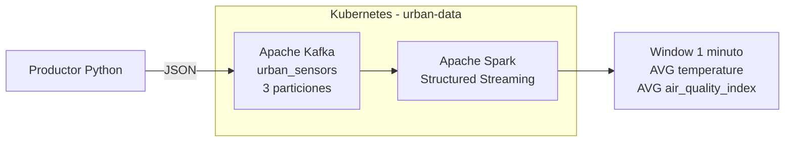

### Despliegue de Kubernetes

El entorno utiliza Minikube con Docker.

Iniciar el cluster:

```powershell
minikube start --driver=docker
```

Verificar:

```powershell
kubectl get nodes
```

Crear el namespace:

```powershell
kubectl apply -f k8s/namespace.yaml
```

### Despliegue de Kafka

Aplicar los manifiestos:

```powershell
kubectl apply -f k8s/kafka-configmap.yaml
kubectl apply -f k8s/kafka-deployment.yaml
kubectl apply -f k8s/kafka-service.yaml
```

Verificar el estado:

```powershell
kubectl get pods -n urban-data
```

Kafka debe aparecer en estado `Running`.

### Creación del tópico

Obtener el nombre del pod de Kafka:

```powershell
$KAFKA_POD = kubectl get pods -n urban-data -l app=kafka -o jsonpath="{.items[0].metadata.name}"
```

Crear el tópico `urban_sensors` con 3 particiones:

```powershell
kubectl exec -it $KAFKA_POD -n urban-data -- kafka-topics.sh --create --topic urban_sensors --bootstrap-server kafka-service:9092 --partitions 3 --replication-factor 1
```

Verificar:

```powershell
kubectl exec -it $KAFKA_POD -n urban-data -- kafka-topics.sh --describe --topic urban_sensors --bootstrap-server kafka-service:9092
```

La configuración utilizada es:

```text
Topic: urban_sensors
PartitionCount: 3
ReplicationFactor: 1
```

### Productor de eventos

El archivo:

```text
producer/producer.py
```

genera eventos JSON simulados cada 2 segundos con los siguientes campos:

* `sensor_id`
* `temperature`
* `humidity`
* `air_quality_index`
* `timestamp`

Ejemplo:

```json
{
  "sensor_id": "sensor_3",
  "temperature": 25.42,
  "humidity": 61.7,
  "air_quality_index": 84,
  "timestamp": "2026-08-14T13:16:25.123456"
}
```

El productor se ejecuta localmente y utiliza un port-forward para comunicarse con Kafka dentro de Kubernetes.

Mantener una terminal ejecutando:

```powershell
kubectl port-forward service/kafka-service 9094:9094 -n urban-data
```

En otra terminal:

```powershell
python producer/producer.py
```

El productor utiliza un intervalo de 2 segundos entre eventos para evitar una generación excesiva de mensajes durante las pruebas locales y permitir observar el flujo de datos de forma controlada.

Durante las pruebas se verificó correctamente la llegada de los eventos al tópico `urban_sensors`.

Los mensajes pueden comprobarse mediante:

```powershell
kubectl exec -it $KAFKA_POD -n urban-data -- kafka-console-consumer.sh --bootstrap-server kafka-service:9092 --topic urban_sensors --from-beginning --max-messages 10
```

### Despliegue de Spark

Aplicar los manifiestos correspondientes:

```powershell
kubectl apply -f k8s/spark-configmap.yaml
kubectl apply -f k8s/spark-job-configmap.yaml
kubectl apply -f k8s/spark-deployment.yaml
```

Verificar:

```powershell
kubectl get pods -n urban-data
```

Kafka y Spark deben aparecer en estado `Running`.

El Deployment de Spark monta automáticamente `streaming_job.py` desde el ConfigMap `spark-job-script` y ejecuta el job mediante `spark-submit`.

### Procesamiento en tiempo real

El archivo:

```text
spark/streaming_job.py
```

consume los eventos desde Kafka utilizando Spark Structured Streaming.

El job:

* Interpreta los mensajes JSON.
* Utiliza el campo `timestamp` como tiempo del evento.
* Aplica un watermark de 1 minuto.
* Utiliza ventanas de tiempo de 1 minuto.
* Agrupa los eventos por `sensor_id`.
* Calcula el promedio de `temperature`.
* Calcula el promedio de `air_quality_index`.

Los resultados pueden consultarse mediante:

```powershell
kubectl logs deployment/spark-streaming -n urban-data --tail=120
```

Durante la prueba se obtuvo una salida como:

```text
+------------------------------------------+---------+------------------+---------------------+
|window                                    |sensor_id|avg_temperature   |avg_air_quality_index|
+------------------------------------------+---------+------------------+---------------------+
|{2026-08-14 13:16:00, 2026-08-14 13:17:00}|sensor_2 |24.98107431807679 |85.28392279241794    |
|{2026-08-14 13:16:00, 2026-08-14 13:17:00}|sensor_1 |24.991138767890465|84.62329580811223    |
|{2026-08-14 13:16:00, 2026-08-14 13:17:00}|sensor_4 |25.03353926461307 |85.36511214363563    |
|{2026-08-14 13:16:00, 2026-08-14 13:17:00}|sensor_5 |24.992562948615664|84.68531388857241    |
|{2026-08-14 13:16:00, 2026-08-14 13:17:00}|sensor_3 |25.03867602127421 |85.04498132850514    |
+------------------------------------------+---------+------------------+---------------------+
```

Esto confirma la comunicación exitosa entre Kafka y Spark y el procesamiento de los eventos en tiempo real.

### Evidencias de la Preentrega 3

#### Kafka: tópico, particiones y comunicación

La siguiente evidencia muestra el tópico `urban_sensors` configurado con 3 particiones y una prueba de envío y recepción de un evento mediante Kafka.


#### Productor Python

El productor genera eventos simulados de sensores urbanos con los campos `sensor_id`, `temperature`, `humidity`, `air_quality_index` y `timestamp`, y los envía hacia Kafka mediante el listener expuesto localmente.


#### Spark Structured Streaming

Spark consume los eventos provenientes de Kafka y procesa el flujo utilizando ventanas de 1 minuto, calculando el promedio de temperatura y del índice de calidad del aire para cada sensor.


## Preentrega 4: procesamiento en tiempo real con Apache Flink

La cuarta etapa del proyecto incorpora procesamiento stateful en AWS utilizando Amazon Kinesis Data Streams y AWS Managed Service for Apache Flink.

El flujo implementado es:

```text
Productor PowerShell
        |
        v
Amazon Kinesis Data Streams
        |
        v
AWS Managed Service
for Apache Flink 1.20
        |
        v
Deserialización JSON
        |
        v
Event Time + Watermarks
        |
        v
keyBy(sensor_id)
        |
        v
Tumbling Window de 1 minuto
        |
        +-- Cantidad de eventos
        +-- Promedio de temperatura
        +-- Promedio de humedad
        `-- Promedio de calidad del aire
        |
        v
Amazon CloudWatch Logs
```

### Arquitectura

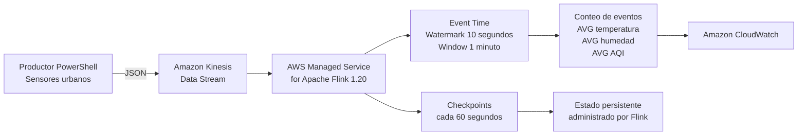

### Infraestructura de Flink

La infraestructura necesaria para Managed Flink está declarada mediante Terraform dentro de:

```text
terraform/modules/flink/
```

El módulo crea la aplicación de procesamiento, el bucket utilizado para almacenar el artefacto JAR, el rol y la política IAM necesarios y la integración con CloudWatch Logs.

La aplicación utiliza:

```text
Runtime: FLINK-1_20
Parallelism: 1
Parallelism per KPU: 1
Auto Scaling: deshabilitado
```

El Data Stream de Kinesis utilizado como fuente se configura mediante una propiedad de ejecución denominada:

```text
InputStream
```

que contiene el ARN del stream.

### Aplicación Flink

La aplicación está implementada en Java:

```text
flink/src/main/java/com/dataops/flink/SensorStreamingJob.java
```

El job obtiene el ARN del Kinesis Data Stream desde las propiedades configuradas en AWS Managed Service for Apache Flink.

Los eventos utilizados contienen:

* `sensor_id`
* `temperature`
* `humidity`
* `air_quality_index`
* `timestamp`

Ejemplo:

```json
{
  "sensor_id": "sensor_3",
  "temperature": 25.42,
  "humidity": 61.70,
  "air_quality_index": 84,
  "timestamp": "2026-08-21T19:10:35.0000000Z"
}
```

### Event Time y Watermarks

El campo `timestamp` de cada mensaje se utiliza como tiempo del evento.

La aplicación utiliza un Watermark con una tolerancia máxima de 10 segundos para eventos que puedan llegar fuera de orden.

La estrategia utilizada es equivalente a:

```text
WatermarkStrategy.forBoundedOutOfOrderness(Duration.ofSeconds(10))
```

También se configura una detección de inactividad de 30 segundos para evitar que una fuente temporalmente inactiva impida el avance global del Watermark.

### Ventanas y procesamiento stateful

Después de deserializar los eventos, el flujo se agrupa utilizando:

```text
keyBy(sensor_id)
```

Posteriormente se aplican ventanas Tumbling Event Time de 1 minuto.

Dentro de cada ventana se calcula:

* Cantidad de eventos.
* Temperatura promedio.
* Humedad promedio.
* Índice promedio de calidad del aire.

El operador de ventanas mantiene estado administrado por Apache Flink durante el procesamiento.

Los resultados se registran utilizando el logger de la aplicación y pueden consultarse posteriormente mediante CloudWatch.

Durante las pruebas se obtuvo, por ejemplo:

```text
WINDOW_RESULT sensor=sensor_1 |
window_start=2026-08-21T19:10:00Z |
window_end=2026-08-21T19:11:00Z |
events=6 |
avg_temperature=23.37 |
avg_humidity=56.41 |
avg_aqi=126.83
```

También se observaron resultados correspondientes a múltiples sensores y varias ventanas consecutivas de un minuto.

### Checkpoints y tolerancia a fallos

La aplicación utiliza checkpoints automáticos para permitir la recuperación del estado ante fallos.

La configuración declarada mediante Terraform es:

```text
Checkpoint interval: 60000 ms
Minimum pause between checkpoints: 5000 ms
Checkpointing: enabled
```

Durante las pruebas se verificó la creación continua de checkpoints.

Entre los checkpoints observados se encontraron:

```text
Completed checkpoint 52
Completed checkpoint 53
Completed checkpoint 54
Completed checkpoint 55
Completed checkpoint 56
Completed checkpoint 57
Completed checkpoint 58
```

Los logs de Managed Flink también mostraron la escritura de metadata asociada a los checkpoints mediante el sistema de archivos S3 utilizado por el servicio.

### Compilación de la aplicación

La aplicación Java utiliza Maven.

Desde la raíz del repositorio puede compilarse mediante:

```powershell
mvn -f .\flink\pom.xml clean package
```

La compilación genera el artefacto:

```text
flink/target/realtime-flink-processing-1.0.0.jar
```

La carpeta:

```text
flink/target/
```

está excluida del control de versiones.

Durante el despliegue, Terraform toma este JAR local y lo almacena dentro del bucket de artefactos de Flink.

El nombre del objeto almacenado en S3 incluye una parte del hash del archivo.

Por ejemplo:

```text
flink/realtime-flink-processing-78e105f2.jar
```

Esto permite que Terraform detecte cambios en el código de la aplicación y actualice el artefacto utilizado por Managed Flink.

### Despliegue mediante Terraform

Desde:

```powershell
cd terraform\environments\dev
```

se puede ejecutar:

```powershell
terraform init
terraform validate
terraform plan
terraform apply
```

La aplicación Managed Flink se crea inicialmente detenida.

Para consultar su estado:

```powershell
aws kinesisanalyticsv2 describe-application --application-name realtime-data-platform-dev-flink --query "ApplicationDetail.ApplicationStatus" --output text --region us-east-1
```

Una aplicación desplegada pero detenida aparece como:

```text
READY
```

Para iniciarla:

```powershell
aws kinesisanalyticsv2 start-application --application-name realtime-data-platform-dev-flink --region us-east-1
```

Durante la ejecución, el estado esperado es:

```text
RUNNING
```

### Generación de eventos de prueba

El archivo:

```text
scripts/send_sensor_events.ps1
```

genera eventos JSON simulando sensores urbanos y los envía directamente al Kinesis Data Stream.

Para realizar una prueba prolongada se utilizó:

```powershell
.\scripts\send_sensor_events.ps1 -RecordCount 180 -DelayMilliseconds 500
```

Durante la prueba se generaron datos correspondientes a cinco sensores diferentes y se enviaron correctamente 180 eventos.

### Consulta de resultados en CloudWatch

Los resultados de las ventanas pueden consultarse utilizando:

```powershell
aws logs filter-log-events --log-group-name "/aws/managed-flink/realtime-data-platform-dev" --filter-pattern "WINDOW_RESULT" --region us-east-1 --query "events[].message" --output text --no-cli-pager
```

Los mensajes muestran el sensor procesado, la ventana temporal, la cantidad de eventos y los valores promedio obtenidos.

Los checkpoints también pueden consultarse mediante los logs de CloudWatch.

### Evidencias de la Preentrega 4

#### Productor hacia Kinesis

El productor PowerShell genera eventos JSON de sensores urbanos y los envía directamente hacia Amazon Kinesis Data Streams.

Durante la prueba se enviaron correctamente 180 eventos.

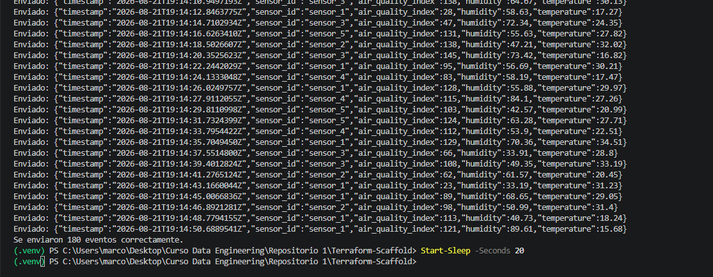

#### Procesamiento de ventanas con Flink

Los logs de CloudWatch muestran los resultados generados por Flink para múltiples sensores y ventanas consecutivas de un minuto.

Cada resultado incluye la cantidad de eventos procesados y los promedios de temperatura, humedad y calidad del aire.

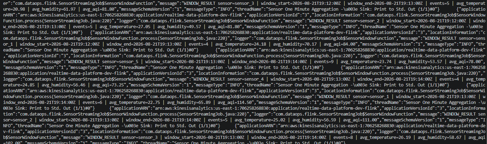

#### Checkpoints de Flink

Durante la ejecución se verificó que los checkpoints se completaran periódicamente.

La evidencia muestra múltiples checkpoints finalizados correctamente junto con su tamaño y duración.

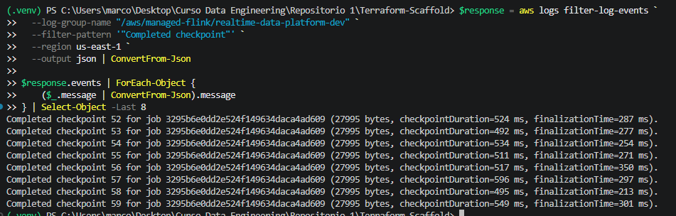

#### Aplicación AWS Managed Service for Apache Flink

La aplicación `realtime-data-platform-dev-flink` fue desplegada correctamente utilizando Apache Flink 1.20.


#### Amazon Kinesis Data Stream

El stream `realtime-data-platform-dev-stream` fue desplegado correctamente en modo provisionado utilizando dos shards.


#### Artefacto JAR en Amazon S3

El artefacto compilado de la aplicación fue almacenado correctamente en el bucket S3 destinado a Managed Flink.


## Preentrega 5: Lakehouse con Apache Iceberg

La quinta etapa del proyecto extiende el procesamiento en tiempo real desarrollado con Apache Flink incorporando una capa Lakehouse basada en Apache Iceberg.

Los resultados agregados de las ventanas dejan de utilizarse únicamente como salida de monitoreo y también se persisten como una tabla Iceberg almacenada en Amazon S3 y registrada dentro de AWS Glue Data Catalog.

El flujo implementado es:

```text
Amazon Kinesis Data Streams
        |
        v
AWS Managed Service
for Apache Flink 1.20
        |
        v
Event Time + Watermarks
        |
        v
Tumbling Window de 1 minuto
        |
        v
Agregaciones por sensor_id
        |
        v
Apache Iceberg Sink
        |
        +--------------------------+
        |                          |
        v                          v
Amazon S3                  AWS Glue Data Catalog
Parquet + Metadata         lakehouse_db
                           sensor_metrics
        |                          |
        +------------+-------------+
                     |
                     v
                Amazon Athena
```

### Arquitectura

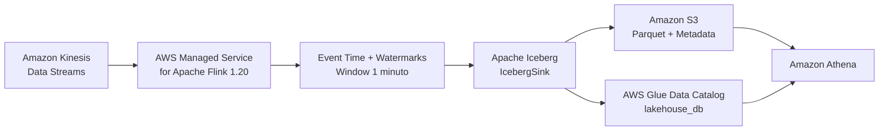

### Infraestructura del Lakehouse

La infraestructura de esta etapa está declarada mediante Terraform dentro de:

```text
terraform/modules/lakehouse/
```

El módulo crea un bucket S3 dedicado al almacenamiento del warehouse de Apache Iceberg.

El bucket posee:

```text
Versioning: Enabled
Server-side encryption: AES256
Public access: Blocked
```

También se crea mediante Terraform la base de datos:

```text
lakehouse_db
```

dentro de AWS Glue Data Catalog.

El warehouse utilizado por Apache Iceberg se encuentra dentro de:

```text
s3://realtime-data-platform-dev-lakehouse-<account-id>/warehouse/
```

La ubicación se expone mediante outputs de Terraform y se entrega al módulo de Flink como propiedad de ejecución.

### Integración entre Flink e Iceberg

La aplicación:

```text
flink/src/main/java/com/dataops/flink/SensorStreamingJob.java
```

fue extendida para persistir los resultados calculados por las ventanas utilizando Apache Iceberg.

La configuración utiliza:

```text
Catalog: GlueCatalog
FileIO: S3FileIO
Database: lakehouse_db
Table: sensor_metrics
```

Las propiedades necesarias para la integración son configuradas dentro de Managed Flink mediante el grupo:

```text
IcebergCatalog
```

que contiene:

```text
warehouse.path
database.name
```

AWS Glue actúa como catálogo central de la tabla mientras que Amazon S3 almacena físicamente los datos y la metadata administrada por Iceberg.

### Dependencias de Apache Iceberg

El proyecto Maven fue extendido para incorporar las dependencias necesarias para utilizar Apache Iceberg con Flink 1.20 y AWS.

Entre las dependencias utilizadas se encuentran:

```text
iceberg-flink-runtime-1.20
iceberg-aws-bundle
hadoop-client-api
hadoop-client-runtime
```

La aplicación continúa empaquetándose como un JAR mediante Maven para posteriormente ser subida al bucket de artefactos utilizado por Managed Flink.

### Tabla `sensor_metrics`

La aplicación crea la tabla:

```text
lakehouse_db.sensor_metrics
```

si todavía no existe en AWS Glue.

El esquema utilizado contiene siete columnas:

```text
sensor_id
window_start
window_end
event_count
avg_temperature
avg_humidity
avg_aqi
```

Cada registro representa el resultado agregado de un sensor para una ventana de Event Time de un minuto.

Los datos almacenados contienen:

* Identificador del sensor.
* Inicio de la ventana.
* Fin de la ventana.
* Cantidad de eventos procesados.
* Temperatura promedio.
* Humedad promedio.
* Índice promedio de calidad del aire.

### Estrategia de particionamiento

La tabla Iceberg utiliza una transformación de particionamiento basada en:

```text
day(window_start)
```

Durante las pruebas, los archivos de datos fueron almacenados en rutas como:

```text
data/window_start_day=2026-08-23/
```

Se utilizó `window_start` porque los datos generados son métricas temporales y las consultas analíticas normalmente se realizan sobre períodos de tiempo.

El particionamiento por día permite que Apache Iceberg aplique partition pruning al consultar rangos temporales.

De esta forma, una consulta filtrada por una fecha o un rango de fechas puede evitar leer archivos correspondientes a días que no forman parte de la consulta, reduciendo la cantidad de datos escaneados.

No se utilizó `sensor_id` como estrategia principal de particionamiento para evitar generar una cantidad excesiva de particiones a medida que aumente el número de sensores.

### Escritura mediante IcebergSink

Después del procesamiento de las ventanas, los resultados son convertidos a filas compatibles con el esquema de Apache Iceberg.

La aplicación utiliza:

```text
IcebergSink
```

para escribir los resultados en la tabla `sensor_metrics`.

Los datos se almacenan físicamente en Amazon S3 en formato Parquet.

Durante la prueba end-to-end se generaron múltiples archivos:

```text
*.parquet
```

dentro de la partición correspondiente al día de procesamiento.

### Checkpoints y commits de Iceberg

La escritura hacia Apache Iceberg está integrada con el mecanismo de checkpoints de Flink.

La aplicación mantiene la configuración utilizada en la preentrega anterior:

```text
Checkpoint interval: 60000 ms
Minimum pause between checkpoints: 5000 ms
Checkpointing: enabled
```

Durante la ejecución se verificaron checkpoints completados correctamente junto con actividad de los componentes:

```text
IcebergWriteAggregator
IcebergCommitter
```

Los commits permiten que los nuevos archivos escritos sean incorporados de forma consistente a la metadata de la tabla Iceberg.

### Metadata de Apache Iceberg

Apache Iceberg mantiene la metadata de la tabla dentro del mismo warehouse en Amazon S3.

La ruta utilizada es:

```text
warehouse/lakehouse_db.db/sensor_metrics/metadata/
```

Durante las pruebas se verificaron múltiples versiones de archivos:

```text
00000-....metadata.json
00001-....metadata.json
00002-....metadata.json
00003-....metadata.json
00004-....metadata.json
00005-....metadata.json
```

También se generaron archivos:

```text
*-m0.avro
snap-*.avro
```

correspondientes a manifests y snapshots utilizados por Apache Iceberg.

La existencia de diferentes versiones de `metadata.json` muestra la evolución de la tabla a medida que se realizan nuevos commits.

### Control de concurrencia

No se agregó una tabla DynamoDB adicional para bloquear los commits de Apache Iceberg.

AWS Glue e Iceberg utilizan optimistic locking para controlar las actualizaciones concurrentes de la metadata de la tabla.

Esto permite detectar si la versión de metadata cambió antes de completar una actualización y evita sobrescribir silenciosamente cambios realizados por otro proceso.

La tabla DynamoDB creada durante la primera preentrega continúa siendo utilizada únicamente para el bloqueo del estado remoto de Terraform.

### Permisos IAM

El rol de ejecución de AWS Managed Service for Apache Flink fue extendido para permitir la interacción con la capa Lakehouse.

Los permisos sobre Amazon S3 permiten:

* Listar el bucket del Lakehouse.
* Leer objetos.
* Escribir objetos.
* Eliminar objetos cuando sea necesario.
* Administrar operaciones multipart.

Los permisos de AWS Glue permiten:

* Consultar bases de datos.
* Consultar tablas.
* Crear tablas.
* Actualizar tablas.

Estos permisos permiten que la aplicación utilice `GlueCatalog` y escriba los resultados mediante Apache Iceberg.

### Generación de eventos de prueba

Para verificar el flujo de la quinta preentrega se utilizó:

```powershell
.\scripts\send_test_events.ps1
```

El script genera eventos JSON compatibles con el esquema esperado por `SensorStreamingJob.java`.

Ejemplo:

```json
{
  "sensor_id": "sensor-01",
  "temperature": 24.37,
  "humidity": 61.82,
  "air_quality_index": 74,
  "timestamp": "2026-08-23T14:50:00.0000000Z"
}
```

Los eventos son enviados al stream:

```text
realtime-data-platform-dev-stream
```

utilizando el identificador del sensor como partition key.

### Verificación de archivos en Amazon S3

Los archivos generados por Apache Iceberg pueden verificarse mediante AWS CLI:

```powershell
aws s3 ls s3://realtime-data-platform-dev-lakehouse-<account-id>/warehouse/ --recursive
```

Durante la prueba se observaron archivos de datos en rutas como:

```text
warehouse/lakehouse_db.db/sensor_metrics/data/window_start_day=2026-08-23/
```

junto con las diferentes versiones de metadata, manifests y snapshots.

Esto confirma que los resultados procesados por Apache Flink fueron persistidos correctamente dentro del Lakehouse.

### Registro en AWS Glue Data Catalog

La tabla fue registrada correctamente en AWS Glue Data Catalog con la siguiente configuración:

```text
Database: lakehouse_db
Table: sensor_metrics
Table format: Apache Iceberg
```

Glue reconoce también el esquema de siete columnas generado por la aplicación.

La ubicación de la tabla apunta al warehouse almacenado en Amazon S3.

### Consulta mediante Amazon Athena

La tabla Iceberg fue consultada desde Amazon Athena utilizando AWS Glue Data Catalog.

La consulta utilizada durante la prueba fue:

```sql
SELECT *
FROM lakehouse_db.sensor_metrics
ORDER BY window_start DESC
LIMIT 20;
```

Athena devolvió correctamente registros correspondientes a diferentes sensores y ventanas de un minuto.

Los resultados incluyen:

```text
sensor_id
window_start
window_end
event_count
avg_temperature
avg_humidity
avg_aqi
```

Esto permite comprobar que los datos transformados por Apache Flink pueden ser consultados directamente desde la capa Lakehouse.

### Validación end-to-end

Durante la prueba final se verificó el flujo completo:

```text
Amazon Kinesis Data Streams
        |
        v
AWS Managed Service for Apache Flink
        |
        v
Event Time + Watermarks
        |
        v
Ventanas de 1 minuto
        |
        v
Agregaciones por sensor
        |
        v
Apache Iceberg
        |
        +--> Amazon S3
        |    Parquet
        |    metadata.json
        |    manifests
        |    snapshots
        |
        +--> AWS Glue Data Catalog
                 |
                 v
             Amazon Athena
```

La prueba confirmó:

* Recepción de eventos desde Kinesis.
* Procesamiento mediante Apache Flink.
* Procesamiento mediante Event Time y Watermarks.
* Generación de ventanas de un minuto.
* Cálculo de las métricas agregadas.
* Escritura de archivos Parquet.
* Generación de metadata de Apache Iceberg.
* Creación de manifests y snapshots.
* Registro de la tabla dentro de AWS Glue.
* Consulta exitosa de la tabla mediante Amazon Athena.

### Evidencias de la Preentrega 5

#### Tabla Apache Iceberg en AWS Glue

AWS Glue Data Catalog muestra la tabla `sensor_metrics` dentro de la base de datos `lakehouse_db`.

La tabla aparece identificada con formato Apache Iceberg y Glue reconoce correctamente las siete columnas utilizadas por el pipeline.

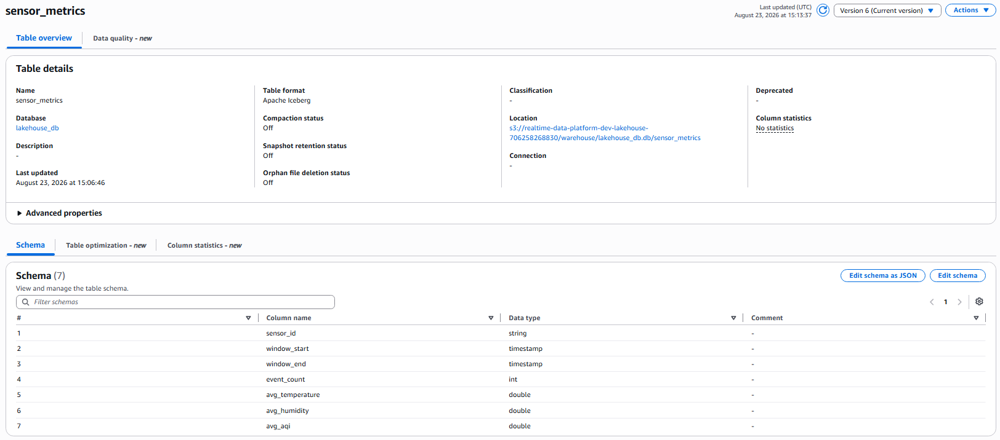

#### Archivos Iceberg almacenados en Amazon S3

La evidencia muestra los archivos Parquet generados por el pipeline junto con las diferentes versiones de `metadata.json`, manifests y snapshots de Apache Iceberg.

También puede observarse la partición generada mediante `window_start_day`.

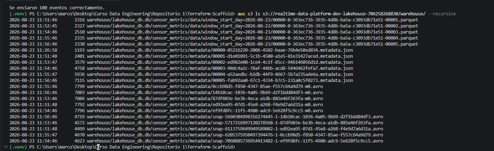

#### Consulta de la tabla mediante Amazon Athena

Amazon Athena permite consultar directamente `lakehouse_db.sensor_metrics` y devuelve los resultados de las ventanas procesadas por Apache Flink.

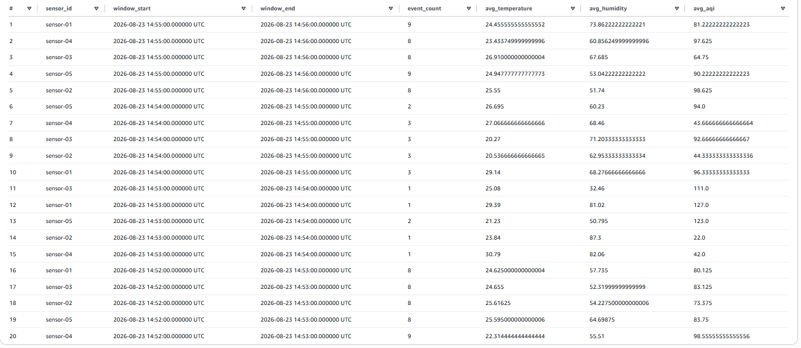

## Preentrega 6: analítica avanzada in-stream con Amazon Redshift

La sexta etapa incorpora Amazon Redshift Serverless como capa analítica de baja latencia.

El objetivo es permitir dos caminos complementarios para los mismos eventos:

* Un camino caliente que consume Kinesis directamente mediante Redshift Streaming Ingestion.
* Un camino histórico que procesa los eventos con Apache Flink y los almacena en Apache Iceberg.

Redshift permite consultar ambas capas dentro de una misma sesión SQL.

El flujo implementado es:

```text
                              Amazon Kinesis Data Streams
                                         |
                       +-----------------+-----------------+
                       |                                   |
                       v                                   v
            Redshift Streaming Ingestion         AWS Managed Service
                       |                         for Apache Flink
                       v                                   |
             sensor_stream_raw                            v
                       |                         Ventanas + Agregaciones
                       v                                   |
            sensor_stream_typed                           v
                       |                             Apache Iceberg
                       v                                   |
             sensor_stream_ready                   +------+------+
                       |                            |             |
                       |                            v             v
                       |                       Amazon S3      AWS Glue
                       |                       Parquet +      Data Catalog
                       |                       Metadata           |
                       |                            |             |
                       +----------------------------+-------------+
                                                    |
                                                    v
                                            Amazon Redshift
                                                    |
                                                    v
                                          JOIN hot + histórico
```

### Arquitectura

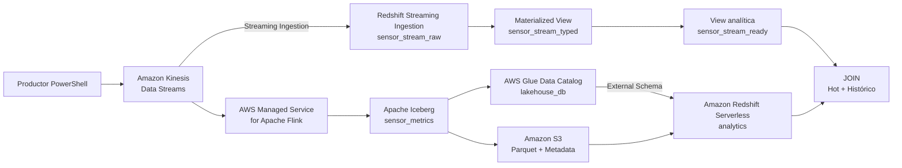

### Infraestructura de Amazon Redshift Serverless

La infraestructura está declarada mediante Terraform dentro de:

```text
terraform/modules/redshift/
```

El módulo crea un Namespace y un Workgroup de Redshift Serverless:

```text
Namespace: realtime-data-platform-dev
Workgroup: realtime-data-platform-dev-wg
Database: analytics
Base capacity: 4 RPU
Max capacity: 4 RPU
Publicly accessible: false
```

Para limitar costos durante las pruebas también se configura un Usage Limit diario:

```text
Usage type: serverless-compute
Amount: 8 RPU-hours
Period: daily
Breach action: deactivate
```

El Workgroup se despliega en las tres subredes privadas del proyecto.

Durante esta etapa se agregó la tercera subred:

```text
10.0.3.0/24
us-east-1c
```

También se habilitaron en la VPC:

```text
enable_dns_support   = true
enable_dns_hostnames = true
```

para permitir el uso de Private DNS en el Interface VPC Endpoint de Kinesis.

### Conectividad privada con Kinesis

Redshift Serverless consume el stream mediante un Interface VPC Endpoint:

```text
com.amazonaws.us-east-1.kinesis-streams
```

El endpoint utiliza las subredes privadas y un Security Group específico que acepta tráfico HTTPS desde el Security Group de Redshift.

De esta forma, la comunicación entre Redshift y Kinesis puede mantenerse dentro de la red de AWS sin requerir acceso público para el Workgroup.

### Rol IAM de Redshift

El módulo crea:

```text
realtime-data-platform-dev-redshift-role
```

El rol es asociado al Namespace como rol IAM por defecto.

Entre sus permisos se encuentran las acciones necesarias para consumir el Kinesis Data Stream:

```text
kinesis:DescribeStream
kinesis:DescribeStreamSummary
kinesis:GetShardIterator
kinesis:GetRecords
kinesis:ListShards
kinesis:ListStreams
```

Debido a que el stream utiliza cifrado KMS mediante la clave administrada de Kinesis, el rol incluye también permiso de descifrado limitado al servicio Kinesis.

Para consultar la capa Lakehouse dispone de permisos de lectura sobre:

* AWS Glue Data Catalog.
* Bucket S3 del Lakehouse.
* Objetos almacenados dentro del warehouse de Apache Iceberg.

### Streaming Ingestion desde Amazon Kinesis

La configuración SQL utilizada se encuentra en:

```text
redshift/streaming_ingestion.sql
```

Redshift se conecta directamente con el stream mediante:

```sql
CREATE EXTERNAL SCHEMA kinesis_stream
FROM KINESIS
IAM_ROLE 'arn:aws:iam::<account-id>:role/realtime-data-platform-dev-redshift-role';
```

El stream utilizado es:

```text
realtime-data-platform-dev-stream
```

Este camino no utiliza Amazon S3 como intermediario.

Los eventos de Kinesis son consumidos directamente por Redshift Streaming Ingestion.

### Materialized View raw

La primera Materialized View utilizada es:

```text
sensor_stream_raw
```

La vista consume directamente:

```text
kinesis_stream."realtime-data-platform-dev-stream"
```

Cada payload se valida antes de parsearse:

```sql
CASE
    WHEN CAN_JSON_PARSE(kinesis_data)
    THEN JSON_PARSE(kinesis_data)
    ELSE NULL
END AS payload
```

Los eventos que no pueden interpretarse como JSON quedan disponibles mediante:

```text
failed_payload
```

Durante las pruebas los eventos válidos fueron almacenados en `payload` y `failed_payload` permaneció en `NULL`.

### Modelado del JSON

Los eventos enviados contienen los campos:

```text
sensor_id
timestamp
temperature
humidity
air_quality_index
```

La Materialized View:

```text
sensor_stream_typed
```

extrae estos valores desde el tipo `SUPER` utilizado por Redshift y los convierte a tipos SQL.

El resultado contiene:

```text
sensor_id              VARCHAR
event_timestamp_raw    VARCHAR
temperature            DECIMAL(5,2)
humidity               DECIMAL(5,2)
air_quality_index      INTEGER
```

El timestamp se mantiene como `VARCHAR` dentro de la Materialized View para conservar el mantenimiento incremental.

La conversión final se realiza en una View convencional:

```text
sensor_stream_ready
```

utilizando:

```sql
TRY_CAST(event_timestamp_raw AS TIMESTAMPTZ)
```

De esta forma se obtiene una capa lista para consultas sin forzar recomputaciones completas de las Materialized Views.

### Estrategia de refresh

Durante el desarrollo se utilizó refresh manual:

```sql
REFRESH MATERIALIZED VIEW sensor_stream_raw;
REFRESH MATERIALIZED VIEW sensor_stream_typed;
```

Esta estrategia permite controlar cuándo Redshift procesa nuevos eventos mientras se realizan pruebas y evita refrescos innecesarios.

La vista de sistema:

```text
SVV_MV_INFO
```

fue utilizada para validar el estado de las Materialized Views.

Durante la prueba ambas mostraron:

```text
state = 1
```

lo que confirma mantenimiento incremental.

El valor:

```text
autorefresh = false
```

corresponde a la estrategia manual utilizada en este entorno de desarrollo.

En un escenario productivo podría evaluarse refresco automático o una frecuencia controlada de aproximadamente 30 a 60 segundos según el SLA de latencia y el costo aceptable.

### Integración con AWS Glue y Apache Iceberg

Redshift también se conecta con el catálogo creado durante la quinta preentrega.

El External Schema se configura mediante:

```sql
CREATE EXTERNAL SCHEMA lakehouse_ext
FROM DATA CATALOG
DATABASE 'lakehouse_db'
REGION 'us-east-1'
IAM_ROLE 'arn:aws:iam::<account-id>:role/realtime-data-platform-dev-redshift-role';
```

Una vez que Apache Flink procesa eventos y crea la tabla Iceberg, Redshift puede visualizar:

```text
lakehouse_ext.sensor_metrics
```

La tabla mantiene las columnas:

```text
sensor_id
window_start
window_end
event_count
avg_temperature
avg_humidity
avg_aqi
```

Esto permite consultar datos históricos almacenados en Apache Iceberg desde la misma base de datos donde se consultan los datos calientes provenientes de Kinesis.

### JOIN entre datos calientes e históricos

Para validar la integración se realizó una consulta que obtiene:

* El evento caliente más reciente de cada sensor desde `sensor_stream_ready`.
* La última ventana histórica disponible para cada sensor desde `lakehouse_ext.sensor_metrics`.

Ambos conjuntos se combinan utilizando:

```text
sensor_id
```

El resultado permite visualizar en una misma fila valores como:

```text
hot_temperature
hot_humidity
hot_aqi
historical_avg_temperature
historical_avg_humidity
historical_avg_aqi
event_count
```

Durante la prueba se obtuvieron resultados para los cinco sensores:

```text
sensor-01
sensor-02
sensor-03
sensor-04
sensor-05
```

Esto valida que Redshift puede combinar el camino de baja latencia con los datos históricos almacenados en el Lakehouse.

### Monitoreo del lag de ingesta

La vista de sistema:

```text
SYS_STREAM_SCAN_STATES
```

se utilizó para observar el comportamiento de Streaming Ingestion.

La consulta permite obtener por shard:

* Registros escaneados.
* Registros omitidos.
* Timestamp del último registro leído.
* Momento del scan realizado por Redshift.
* Lag calculado en segundos.

Durante una de las pruebas se observaron valores similares a:

```text
Shard 0: scanned_rows=26, skipped_rows=0
Shard 1: scanned_rows=33, skipped_rows=0
```

El valor de `skipped_rows = 0` confirmó que no se omitieron eventos durante esos scans.

El lag observado durante la evidencia fue de varios minutos debido a que el entorno estaba utilizando refresh manual. Por lo tanto, este valor incluye el tiempo transcurrido entre la generación de los eventos y la ejecución manual del siguiente refresh y no representa por sí solo la latencia mínima posible de Redshift Streaming Ingestion.

### Seguridad de la capa analítica

Además del rol IAM utilizado para la comunicación entre servicios, se creó dentro de Redshift el rol SQL:

```text
analytics_reader
```

El objetivo es separar los permisos administrativos de los permisos necesarios para usuarios analíticos.

El rol recibió permisos acotados:

* `TEMP` sobre la base `analytics`.
* `USAGE` sobre el schema `public`.
* `SELECT` sobre `sensor_stream_raw`.
* `SELECT` sobre `sensor_stream_typed`.
* `SELECT` sobre `sensor_stream_ready`.
* `USAGE` sobre el External Schema `lakehouse_ext`.

Los privilegios fueron validados mediante:

```sql
SHOW GRANTS FOR ROLE analytics_reader
FROM DATABASE analytics;
```

De esta forma los consumidores analíticos pueden trabajar con las capas necesarias sin recibir privilegios administrativos sobre Redshift.

### Metadata de Apache Iceberg

Durante esta etapa se volvió a validar la metadata de la tabla Iceberg almacenada en S3.

La ruta consultada fue:

```text
warehouse/lakehouse_db.db/sensor_metrics/metadata/
```

Se observaron múltiples archivos:

```text
00000-....metadata.json
00001-....metadata.json
00002-....metadata.json
snap-....avro
```

Esto confirma que la tabla consultada desde Redshift mantiene la estructura de metadata, manifests y snapshots propia de Apache Iceberg.

### Validación end-to-end

La prueba final de la sexta etapa confirmó los dos caminos del pipeline:

```text
CAMINO HOT

Kinesis
   |
   v
Redshift Streaming Ingestion
   |
   v
sensor_stream_raw
   |
   v
sensor_stream_typed
   |
   v
sensor_stream_ready

CAMINO HISTÓRICO

Kinesis
   |
   v
Apache Flink
   |
   v
Apache Iceberg
   |
   +--> Amazon S3
   |
   `--> AWS Glue Data Catalog

INTEGRACIÓN

sensor_stream_ready
        |
        +---- JOIN por sensor_id ----+
                                    |
                                    v
                    lakehouse_ext.sensor_metrics
```

La prueba confirmó:

* Ingesta directa de Kinesis a Redshift sin S3 intermedio.
* Validación y parseo correcto de eventos JSON.
* Conversión a tipos SQL.
* Materialized Views con mantenimiento incremental.
* Consulta de datos calientes desde Redshift.
* Consulta de Apache Iceberg mediante AWS Glue Data Catalog.
* Consulta de metadata y snapshots Iceberg almacenados en S3.
* JOIN entre datos calientes e históricos.
* Monitoreo del lag por shard.
* Ausencia de registros omitidos durante el scan observado.
* Acceso analítico mediante un rol SQL de permisos restringidos.

### Evidencias de la Preentrega 6

#### Streaming Ingestion desde Kinesis

La evidencia muestra los eventos consumidos directamente por `sensor_stream_raw`.

Los payloads JSON fueron interpretados correctamente y `failed_payload` permanece vacío para los registros válidos.

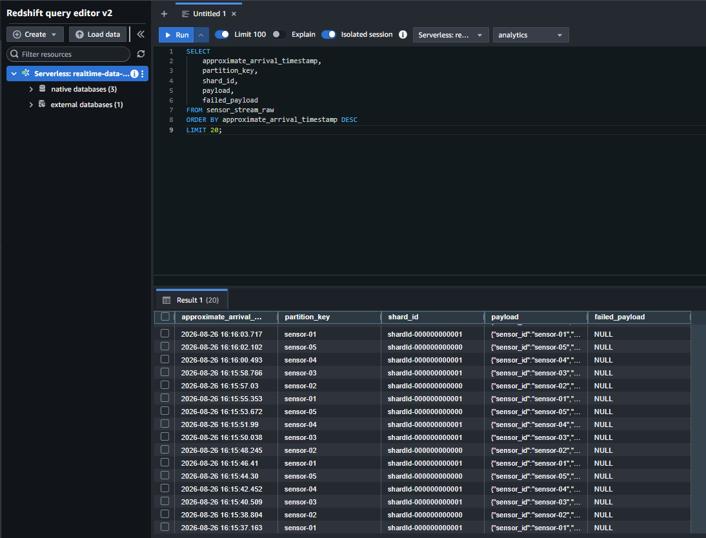

#### Vista analítica de datos calientes

La View `sensor_stream_ready` expone los datos del stream mediante columnas SQL listas para consulta.

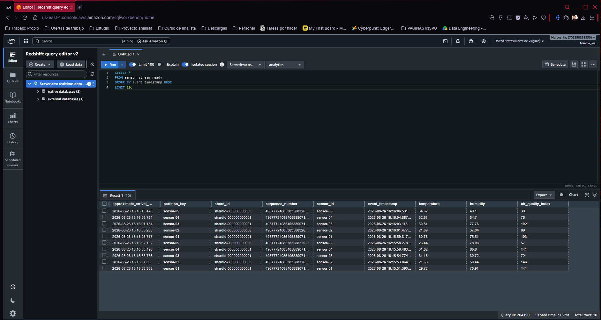

#### Mantenimiento incremental de Materialized Views

La vista `SVV_MV_INFO` confirma `state = 1` para las Materialized Views `sensor_stream_raw` y `sensor_stream_typed`.

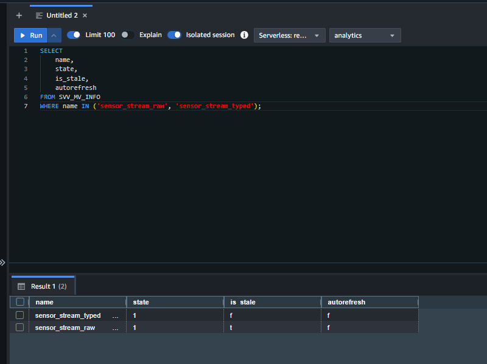

#### Consulta de Apache Iceberg desde Redshift

Redshift consulta directamente la tabla externa `lakehouse_ext.sensor_metrics`, registrada mediante AWS Glue Data Catalog.

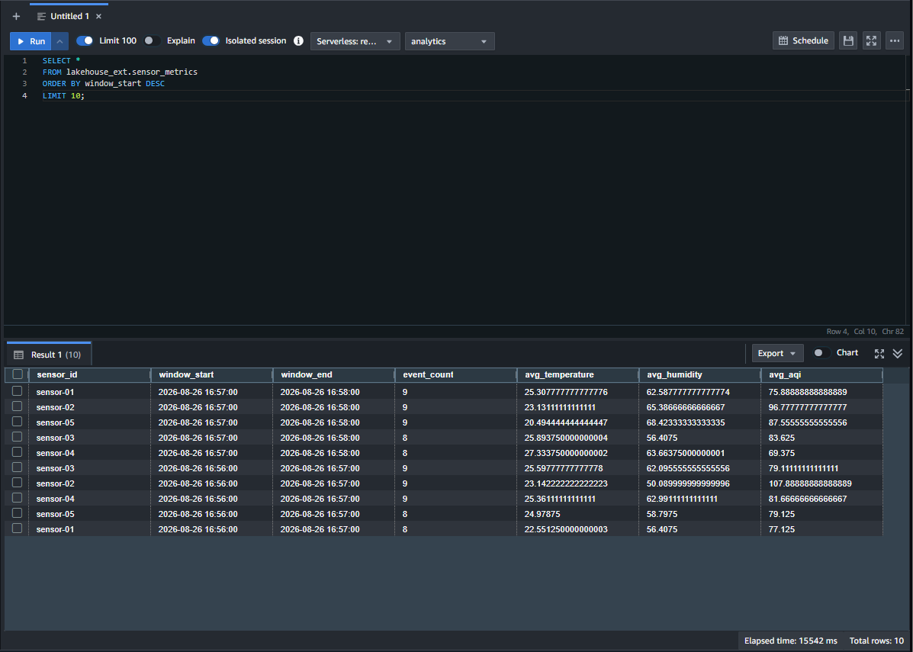

#### JOIN entre datos calientes e históricos

La consulta combina el evento más reciente de cada sensor con su última ventana agregada almacenada en Apache Iceberg.

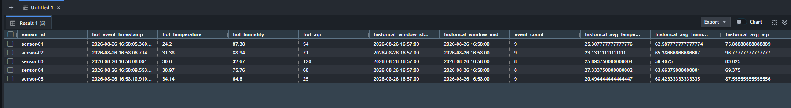

#### Monitoreo del lag de ingesta

`SYS_STREAM_SCAN_STATES` permite visualizar los registros procesados y omitidos y calcular el lag observado para cada shard.

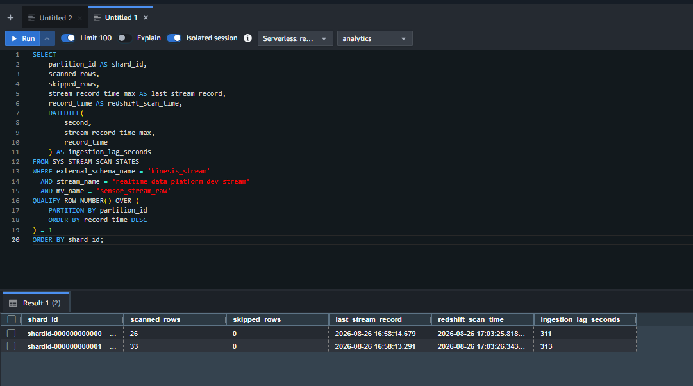

#### Seguridad de la capa analítica

Los grants del rol `analytics_reader` muestran los permisos acotados otorgados para consumir la capa analítica.

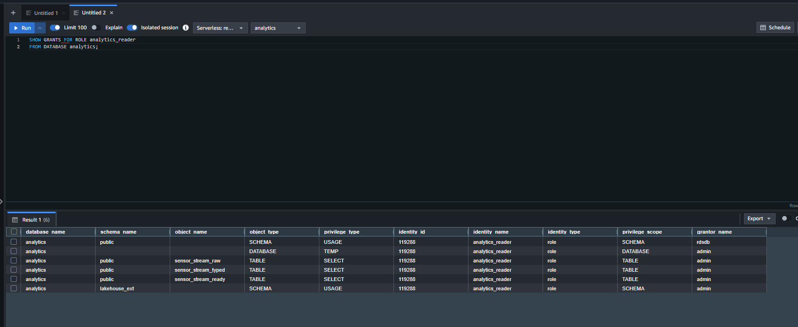

#### Metadata de Apache Iceberg

La evidencia muestra las versiones de `metadata.json`, manifests y snapshots almacenados en S3 para la tabla `sensor_metrics`.

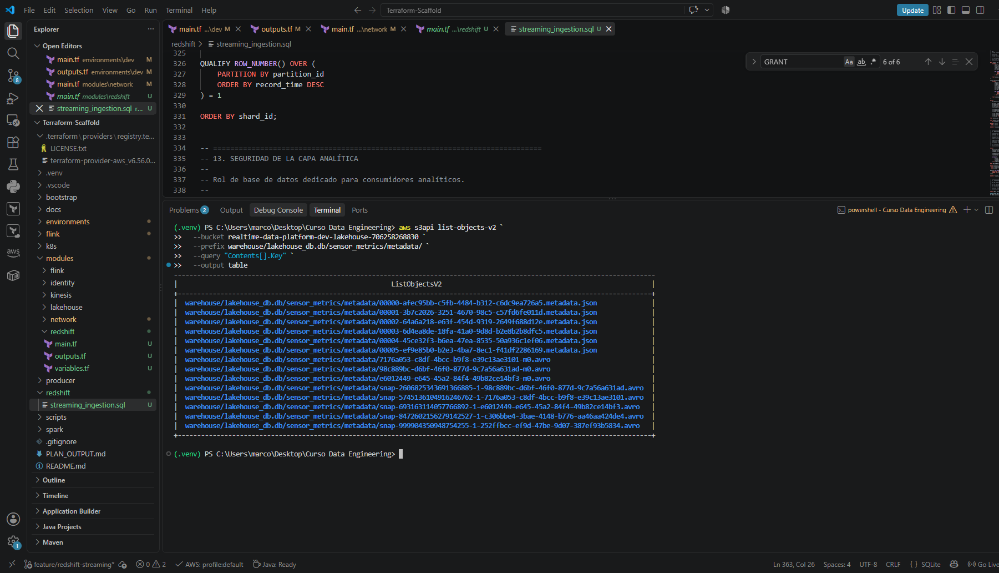

### Limpieza de recursos

Una vez finalizadas las pruebas, la aplicación puede detenerse mediante:

```powershell
aws kinesisanalyticsv2 stop-application --application-name realtime-data-platform-dev-flink --region us-east-1
```

Para evitar costos innecesarios, los recursos administrados por el entorno de desarrollo, incluyendo Redshift Serverless y el Interface VPC Endpoint de Kinesis, pueden eliminarse desde:

```text
terraform/environments/dev
```

mediante:

```powershell
terraform destroy
```

El backend remoto ubicado en `terraform/bootstrap` se mantiene separado del entorno de desarrollo y no forma parte de este proceso de destrucción.

El bucket del Lakehouse utiliza `force_destroy` dentro del entorno de desarrollo, por lo que al ejecutar `terraform destroy` también se eliminan los archivos Parquet, la metadata, los manifests y los snapshots de Apache Iceberg generados durante las pruebas.

## Validación del código

Desde la raíz del repositorio se puede aplicar formato a todos los archivos:

```powershell
terraform fmt -recursive
```

Luego, desde cada configuración de Terraform, se puede ejecutar:

```powershell
terraform validate
terraform plan
```

El archivo `PLAN_OUTPUT.md` contiene el resultado de uno de los planes realizados durante el desarrollo.

La aplicación Java puede compilarse y validarse mediante Maven utilizando:

```powershell
mvn -f .\flink\pom.xml clean package
```

## Seguridad y control de versiones

El archivo `.gitignore` evita subir al repositorio:

* Carpetas `.terraform`.
* Entornos virtuales `.venv`.
* Archivos `terraform.tfstate`.
* Archivos `terraform.tfvars`.
* Copias de respaldo del estado.
* Archivos temporales.
* Credenciales y secretos.
* Configuración local de VS Code.
* Artefactos de compilación de Maven dentro de `flink/target/`.

Los archivos `.terraform.lock.hcl` sí se incluyen para mantener versiones consistentes de los providers.